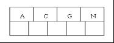

##基于java实现一个二叉树结构，显示增删改查的方法

###1. 二叉树的概念和结构
#####1.什么二叉树？
* 二叉树（Binary Tree）二叉树主要指每个节点最多只有两个子节点的树形结构。

>>>关键词： 二叉树，递归，左子树，右子树，左孩子，右孩子，满二叉树，完全二叉树，二叉树遍历，前序遍历，中序遍历，后序遍历，叶子节点，深度。

  
###11/21/2019 9:29:31 AM 
#####二叉树的基本概念
#######[参考](https://blog.csdn.net/u012928324/article/details/61194190?utm_source=itdadao&utm_medium=referral)
1. 子树：二叉树每个结点的分支称作该结点的子树，其左侧分支称为左子树，右侧分支称为右子树；
2. 结点层次：一个结点的层次直观来说	就是其所在的行，其中根节点的层次为1（第一行），其子结点层次为2（第二行），以此类推，第一行结点为1.
3. 二叉树的深度（高度）二叉树深度（高度）指的是二叉树中的最大叶子结点所在的层  
   * 二叉树的深度=max(左子树的深度，右子树的深度）+1，可用递归的方式实现； 
 
4. 结点的度：二叉树结点的度指的是该结点分支的个数，一棵非空二叉树结点的度有以下三种情况：
   * 没有分支的结点的度为0；
   * 只有一个分支结点的度为1；
   * 有两个分支的结点的度为2；
   * 二叉树最大结点的度为2.
5. 二叉树结点主要有以下几种：
   
   * 根节点 ：第一层结点,如图1
   * 叶子结点：度为0的结点，如图6,7,8,9,10
   * 分支结点：度不为0的结点，如图1,2,3,4,5
   * 孩子结点：结点子树的根称为该结点的孩子，如2和3是1的孩子，4和5是2的孩子
   * 兄弟结点：同一双亲的孩子结点如2,3 4,5 6,7 8,9
   * 祖先结点：从根到该结点的所经分支的所有结点，如10的祖先结点是1,2,5
   * 子孙结点：以某结点为根的子树中任一结点都称为该结点的子孙
6. 关于结点有以下性质：
   * 在非空的二叉树中，第i层结点总数最大为2^i-1,i>=1(满树情况)
   * 深度为h的二叉树最多有2^h-1个结点(h>=1),最少有h个结点
   * 对于任意一棵二叉树，设其总结点数为N,其叶结点（度为0的结点）数为N0,而度数为2的结点总数为N2，则N0=N2+1,度为1的结点数N1=N-N0-N2
   * 具有n个结点的完全二叉树的深度为log(N+1)，底数为2
   * 有N个结点的完全二叉树各结点如果用顺序方式存储，则结点之间有如下关系： 
     * 若I为结点编号则 如果I>1，则其父结点的编号为I/2 
     * 如果2×I<=N，则其左儿子（即左子树的根结点）的编号为2×I 
     * 若2×I>N，则无左儿子 
     * 如果2×I+1<=N，则其右儿子的结点编号为2×I+1 
     * 若2×I+1>N，则无右儿子
     * 给定N个结点，能构成h(N)种不同的二叉树。 h(N)为卡特兰数的第N项。h(n)=C(2*n，n)/(n+1)
     * 设有i个分支点，I为所有分支点的道路长度总和，J为叶的道路长度总和J=I+2i

#####2. 什么是有序二叉树？
* 满足以下三个特征的叫作有序二叉树
  1. 左子树中的任意节点元素都小于根节点元素值；
  2. 右子树中的任意节点元素都大于根节点的元素值；
  3. 左子树和右子树内部也遵守上述规则；

>>TreeSet的底层是有序二叉树。   
#####平衡因子 = 右子树的高度 - 左子树的高度

    -1   ： 表示左子树比右子树高  
	 1   : 表示右子树比左子树高  
	 0   ： 表示左子树和右子树等高  

###11/21/2019 10:12:48 AM 
####4. 什么是完全二叉树？
* 若设二叉树的高度为h，其他各层结点数都达到最大个数，第h层有叶子结点，并且叶子结点都是从左到右依次排布

* 特点：  
	1. 叶子节点出现在最下层和次下层  
	2. 最下层的叶子结点集中在树的左部  
	3. 倒数第二层若存在叶子结点，一定在右部连续位置  
	4. 如果结点度为1，则该结点只有左孩子，即没有右子树。  
	5. 同样结点数目的二叉树，完全二叉树深度最小  
>注：满二叉树一定是完全二叉树，但反过来不一定成立  
###11/21/2019 10:22:44 AM 
####5. 什么是满二叉树？
* 除了叶结点外每一个结点都有左右子叶且叶子结点都处在最底层的二叉树

###11/21/2019 10:32:43 AM 
####3. 什么是平衡二叉树？
[参考](https://blog.csdn.net/xiaojin21cen/article/details/97602146)

* 平衡二叉搜索树（Self-balancing binary search tree）又被称为AVL树（有别于AVL算法），且具有以下性质
  1. 它是一颗空树；
  2. 它的左子树和右子树都是平衡二叉树，且左子树和和右子树的深度差不超过1；
  3. 若将二叉树节点的平衡因子定义为该节点的左子树的深度减去它右子树的深度，则平衡二叉树上所有节点的平衡因子只可能为-1,0,1；
  4. 只要二叉树上有一个节点的平衡因子的绝对值大于1，那么这个平衡二叉树就失去了平衡。  

#####左左型
* 在结点T的左结点的左子树上做了插入元素的操作，我们称这种情况为 左左型 ，我们应该进行右旋转(只需旋转一次，故是单旋转)。

* 右旋的步骤
  1. T向右旋转成为L的右节点
  2. L的右结点成为放在T的左孩子上
  3. 旋转的中心是根节点T的左节点L  
#######这样便得到了新的avl树，旋转过程如下：

#####右右型
* 解决方案：在结点T的右结点的右子树上做了插入元素的操作，我们称这种情况为 右右型 ，我们应该进行左旋转(只需旋转一次，故是单旋转)。

* 左旋的步骤
  1. T向左旋转成为R的左结点
  2. R的左结点Y放在T的右孩子上
  3. 旋转中心是原根节点T的右节点R
######其旋转过程如图下

#####左右型
#######* 解决的方式：左右旋（先左后右）
1. 第一次是左旋转
   * L节点左旋转，成为R节点的左结点
   * R的左结点Y1左旋转，成为L的右节点（即左子节点左转）
2. 第二次是右旋转
   * T节点右旋转，成为R节点的右节点
   * R的右节点Y2右旋转，成为T的左结点（即右子节点右转）
3. 旋转的中心是根节点T的左结点R

#####右左型
#######* 解决的方式：右左旋（先右后左）
1. 第一次是右旋转
   * R节点右旋转，成为L的右节点
   * L右节点Y2右旋转，成为R的左结点（即右子节点右转）
2. 第二次是左旋转
   * T节点向左旋转，，成为L的左结点
   * L的左子节点Y1左旋转，成为T的右节点（即左子节点左转）
3. 旋转中心的原根节点T的右节点L

###11/21/2019 3:17:24 PM 
####4. 什么是红黑树？
[参考](https://www.cnblogs.com/51life/p/9324321.html)
#######* 为什么需要红黑树
* 对于二叉搜索树，如果插入的数据是随机的，那么它就是接近平衡的二叉树，平衡的二叉树，它的操作效率（查询，插入，删除）效率较高，时间复杂度是O（logN）。但是可能会出现一种极端的情况，那就是插入的数据是有序的（递增或者递减），那么所有的节点都会在根节点的右侧或左侧，此时，二叉搜索树就变为了一个链表，它的操作效率就降低了，时间复杂度为O(N)，所以可以认为二叉搜索树的时间复杂度介于O（logN）和O(N)之间，视情况而定。那么为了应对这种极端情况，红黑树就出现了，它是具备了某些特性的二叉搜索树，能解决非平衡树问题，红黑树是一种接近平衡的二叉树。
#######* 红黑树的特性
1. 每个节点非黑即红
2. 根节点是黑色
3. 如果节点是红色的，那么子节点必须是黑色的（反之，不需要成立）
4. 从根节点到叶结点或空子节点的每条路径，都包含相同数目的黑色节点

#######* 红黑树的效率
* 红黑树的查找，插入和删除操作，时间复杂度都是O(logN)。查找操作时，它和普通的相对平衡的二叉搜索树的效率相同，都是通过相同的方式来查找的，没有用到红黑树特有的特性。但，如果插入的时候是有序数据，那么红黑树的查询效率就比二叉搜索树要高了，因为此时二叉搜索树不是平衡树，它的时间复杂度O(N)。插入和删除操作时，由于红黑树的每次操作平均要旋转一次和变换颜色，所以它比普通的二叉搜索树效率要低一点，不过时间复杂度仍然是O(logN)。总之，红黑树的优点就是对有序数据的查询操作不会慢到O(logN)的时间复杂度。
#######* 对旋转的理解
* 为了保持红黑树的特性，必须要做两件事情：
  1. 使一些节点上升，使一些节点下降，帮助树平衡
  2. 保证不破坏二叉搜索树的特征
* 左旋转
以50为支点进行逆时针旋转，然后75成为了顶点，75的左子节点65成了50的右子节点，这是左旋转。  

* 右旋转
以75为支点进行顺时针旋转，然后50成为了顶点，50的右子节点65成了75的左子节点，这是右旋转。

###11/21/2019 3:50:18 PM 
####5. 什么是B树？
[参考](https://blog.csdn.net/v_JULY_v/article/details/6530142)
#######B-树的由来
* 因为B树的原英文名称为B-tree，而国内很多人喜欢把B-tree译作B-树，其实，这是个非常不好的直译，很容易让人产生误解。如人们可能会以为B-树是一种树，而B树又是一种一种树。而事实上是，B-tree就是指的B树
#######B树和红黑树的异同
* B树与红黑树最大的不同在于，B树的结点可以有许多子女，从几个到几千个。那为什么又说B树与红黑树很相似呢?因为与红黑树一样，一棵含n个结点的B树的高度也为O（lgn），但可能比一棵红黑树的高度小许多，应为它的分支因子比较大。所以，B树可以在O（logn）时间内，实现各种如插入（insert），删除（delete）等动态集合操作。
#######用阶定义的B树 
B树又叫做多路查找树，一棵m阶的B树，特性如下：  
1. 树中的每个结点最多含有m个孩子（m>=2）  
2. 除根结点和一叶子结点外，其他每个节点至少有[ceil(m/2)]个孩子。 ceil是个取上限的函数；  
3. 若根节点不是叶子结点，则至少有2个孩子（特殊情况：没有孩子的根节点，即根节点为叶子结点，整棵树只有一个根节点）  
4. 叶子结点都出现在同一层，叶子结点不包含任何关键字信息  
5. 每个非终端结点中包含有n个关键字信息： (n，P0，K1，P1，K2，P2，......，Kn，Pn)。其中：  
   Ki (i=1...n)为关键字，且关键字按顺序升序排序K(i-1)< Ki。  
   Pi为指向子树根的接点，且指针P(i-1)指向子树种所有结点的关键字均小于Ki，但都大于K(i-1)   
   关键字的个数n必须满足[ceil(m / 2)-1]<= n <= m-1。如下图所示：     

#######用度定义的B树
* B树中每一个结点能包含的关键字（如之前上面的D H和Q T X）数有一个上界和下界。这个下界可以用一个称作B树的最小度数（算法导论中文版上译作度数，最小度数即内节点中节点最小孩子数目）m（m>=2）表示。
* 每个非根的内结点至多有m个子女，每个非根的结点必须至少含有m-1个关键字，如果树是非空的，则根结点至少包含一个关键字；
* 每个结点可包含至多2m-1个关键字。所以一个内结点至多可有2m个子女。如果一个结点恰好有2m-1个关键字，我们就说这个结点是满的
* 当关键字数m=2（t=2的意思是，mmin=2，m可以>=2）时的B树是最简单的（有很多人会因此误认为B树就是二叉查找树，但二叉查找树就是二叉查找树，B树就是B树，B树是一棵含有m（m>=2）个关键字的平衡多路查找树），此时，每个内结点可能因此而含有2个、3个或4个子女，亦即一棵2-3-4树，然而在实际中，通常采用大得多的t值。
#######插入操作
* 插入一个元素时，首先在B树中是否存在，如果不存在，即在叶子结点处结束，然后在叶子结点中插入该新的元素，注意：如果叶子结点空间足够，这里需要向右移动该叶子结点中大于新插入关键字的元素，如果空间满了以致没有足够的空间去添加新的元素，则将该结点进行“分裂”，将一半数量的关键字元素分裂到新的其相邻右结点中，中间关键字元素上移到父结点中（当然，如果父结点空间满了，也同样需要“分裂”操作），而且当结点中关键元素向右移动了，相关的指针也需要向右移。如果在根结点插入新元素，空间满了，则进行分裂操作，这样原来的根结点中的中间关键字元素向上移动到新的根结点中，因此导致树的高度增加一层。如下图所示

1. 插入以下字符字母到一棵空的B 树中（非根结点关键字数小了（小于2个）就合并，大了（超过4个）就分裂）：C N G A H E K Q M F W L T Z D P R X Y S，首先，结点空间足够，4个字母插入相同的结点中，如下图：

2. 当咱们试着插入H时，结点发现空间不够，以致将其分裂成2个结点，移动中间元素G上移到新的根结点中，在实现过程中，咱们把A和C留在当前结点中，而H和N放置新的其右邻居结点中。如下图：

3. 当咱们插入E,K,Q时，不需要任何分裂操作

4. 插入M需要一次分裂，注意M恰好是中间关键字元素，以致向上移到父节点中

5. 插入F,W,L,T不需要任何分裂操作

6. 插入Z时，最右的叶子结点空间满了，需要进行分裂操作，中间元素T上移到父节点中，注意通过上移中间元素，树最终还是保持平衡，分裂结果的结点存在2个关键字元素。

7. 插入D时，导致最左边的叶子结点被分裂，D恰好也是中间元素，上移到父节点中，然后字母P,R,X,Y陆续插入不需要任何分裂操作（别忘了，树中至多5个孩子）。

8. 最后，当插入S时，含有N,P,Q,R的结点需要分裂，把中间元素Q上移到父节点中，但是情况来了，父节点中空间已经满了，所以也要进行分裂，将父节点中的中间元素M上移到新形成的根结点中，注意以前在父节点中的第三个指针在修改后包括D和G节点中。这样具体插入操作的完成，下面介绍删除操作，删除操作相对于插入操作要考虑的情况多点。

###11/21/2019 8:14:57 PM 
#######删除操作
* 以上述插入操作构造的一棵5阶B树（树中最多含有m（m=5）个孩子，因此关键字数最小为ceil(m / 2)-1=2。还是这句话，关键字数小了（小于2个）就合并，大了（超过4个）就分裂）为例，依次删除H,T,R,E。

* 首先删除元素H，当然首先查找H，H在一个叶子结点中，且该叶子结点元素数目3大于最小元素数目ceil(m/2)-1=2，则操作很简单，咱们只需要移动K至原来H的位置，移动L至K的位置（也就是结点中删除元素后面的元素向前移动）

* 下一步，删除T,因为T没有在叶子结点中，而是在中间结点中找到，咱们发现他的继承者W(字母升序的下个元素)，将W上移到T的位置，然后将原包含W的孩子结点中的W进行删除，这里恰好删除W后，该孩子结点中元素个数大于2，无需进行合并操作。

* 下一步删除R，R在叶子结点中,但是该结点中元素数目为2，删除导致只有1个元素，已经小于最小元素数目ceil(5/2)-1=2,而由前面我们已经知道：如果其某个相邻兄弟结点中比较丰满（元素个数大于ceil(5/2)-1=2），则可以向父结点借一个元素，然后将最丰满的相邻兄弟结点中上移最后或最前一个元素到父节点中（有没有看到红黑树中左旋操作的影子?），在这个实例中，右相邻兄弟结点中比较丰满（3个元素大于2），所以先向父节点借一个元素W下移到该叶子结点中，代替原来S的位置，S前移；然后X在相邻右兄弟结点中上移到父结点中，最后在相邻右兄弟结点中删除X，后面元素前移。

* 最后一步删除E， 删除后会导致很多问题，因为E所在的结点数目刚好达标，刚好满足最小元素个数（ceil(5/2)-1=2）,而相邻的兄弟结点也是同样的情况，删除一个元素都不能满足条件，所以需要该节点与某相邻兄弟结点进行合并操作；首先移动父结点中的元素（该元素在两个需要合并的两个结点元素之间）下移到其子结点中，然后将这两个结点进行合并成一个结点。所以在该实例中，咱们首先将父节点中的元素D下移到已经删除E而只有F的结点中，然后将含有D和F的结点和含有A,C的相邻兄弟结点进行合并成一个结点。

* 也许你认为这样删除操作已经结束了，其实不然，在看看上图，对于这种特殊情况，你立即会发现父节点只包含一个元素G，没达标（因为非根节点包括叶子结点的关键字数n必须满足于2=<n<=4，而此处的n=1），这是不能够接受的。如果这个问题结点的相邻兄弟比较丰满，则可以向父结点借一个元素。假设这时右兄弟结点（含有Q,X）有一个以上的元素（Q右边还有元素），然后咱们将M下移到元素很少的子结点中，将Q上移到M的位置，这时，Q的左子树将变成M的右子树，也就是含有N，P结点被依附在M的右指针上。所以在这个实例中，咱们没有办法去借一个元素，只能与兄弟结点进行合并成一个结点，而根结点中的唯一元素M下移到子结点，这样，树的高度减少一层。

###11/25/2019 8:21:33 AM 
####6. [什么是B+树？](https://www.jianshu.com/p/71700a464e97)
<b>B+树的特征</b>  
B+树是一种树数据结构，是一个n叉树，每个节点通常有多个孩子，一棵B+树包含根节点，内部节点和叶子结点。B+树通常用于数据库和操作系统的文件系统中。  
<b>B+树的特点</b>  
* 保持数据稳定有序，其插入与修改拥有较稳定的对数时间复杂度。  
* B+树自底向上插入。   
######B+树和B树的区别
* 有k个子结点的结点必然有k个关键码；
* 非叶结点仅具有索引作用，跟记录有关的信息均存放在叶结点中。
* 树的所有叶结点构成一个有序链表，可以按照关键码排序的次序遍历全部记录。
###11/25/2019 11:12:57 PM 
####7. [了解数据库索引采用B+树数据结构优化查询原理](https://www.cnblogs.com/flysheet/articles/database-index-performance.html)

