###12/4/2019 9:26:40 PM 
###You were not made to live as brutes, but to follow virtue and knowledge.
**不要像畜生一样活着，要追求美德和知识。**
###
设计一套权限管理系统的数据库结构

####用户权限管理数据库设计（RBAC)
	RBAC(Role-Based Access Control,基于角色的访问控制），就是通过角色与权限进行关联。简单来说，一个用户拥有若干角色，每一个角色拥有若干权限。这样，就构造成“用户-角色-权限“的授权模型。在这种模型中，用户与角色之间，角色与权限之间，一般者是多对多的关系。（如下图）
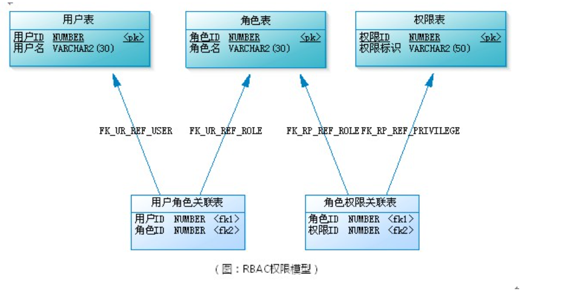

	角色是什么？可以理解为一定数量的权限的集合，权限的载体。例如：一个论坛系统，“超级管理员”，“版主”都是角色。版主可管理版内的贴子、可管理版内的用户等，这些是权限。要给某个用户授予这些权限，不需要直接权限授予用户，可将“版主”这个角色赋予该用户。
	
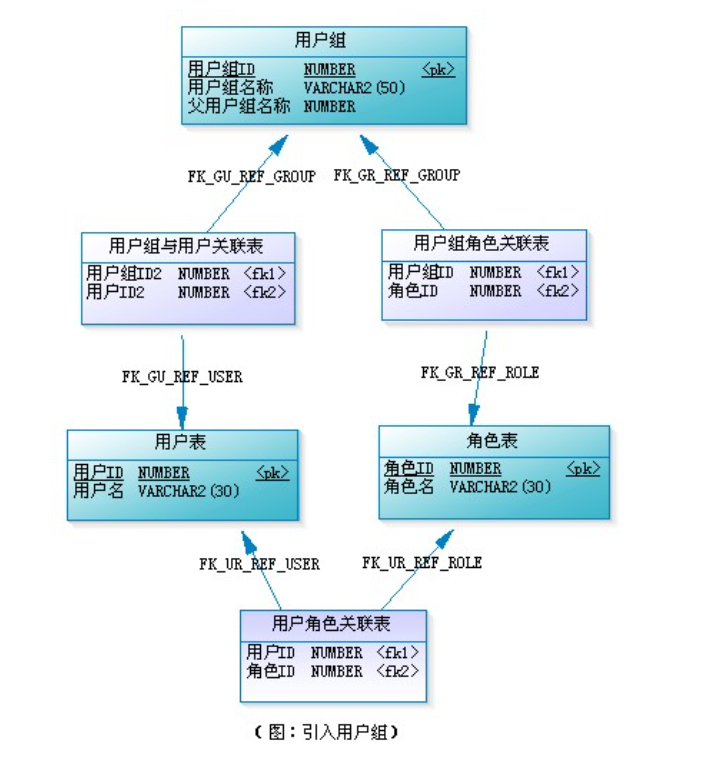

	在应用系统中，权限表现成什么？对功能模块的操作，对上传文件的修改，菜单的访问，甚至页面上某个人按钮，某个图片的可见性控制，都可属于权限的范畴。有些权限设计，会把功能操作作为一类，而把文件、菜单、页面元素等作为一类，这样构成了“用户-角色-权限-资源”的授权模型。而在左数据表建模时，可把功能和资源统一管理，也就是都直接与权限表想关联，这就可能更具有便捷性和易扩展性。（见下图）

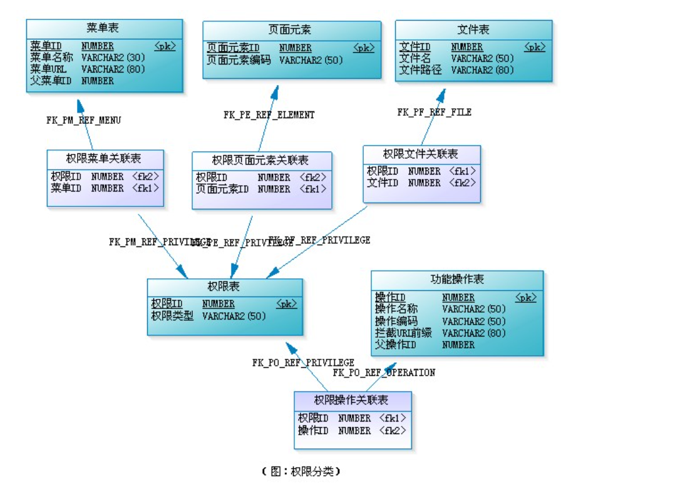

>>注意：需留意权限表中有一列“权限类型”，我们根据他的取值来区分是哪一类权限，如“MENU”表示菜单的访问权限，"OPERATION"表示功能模块的操作权限、”FILE"表示文件的修改权限、”ELEMENT“表示页面元素的可见性控制等。

* 这样设计的优势：
  1. 不需要区分那些是权限操作，那些是资源，（实际上，有时候也不好区分，比如菜单，它是权限呢还是功能模块）
  2. 方便扩展，当系统要对新的东西进行权限控制时，我只需要建立一个新的关联表“权限xx关联表",并确定这类权限的权限类型字符串。

>>需注意：权限表和权限菜单关联表、权限菜单关联表与菜单表都是一对一关系（文件、页面权限点、功能操作等同理）。也就是每添加一个菜单，就得同时往这三个表中个插入一条记录。这样可以不需要权限菜单关联表，让权限表与菜单表直接关联，此时，须在权限表中新增一列用来保存菜单的ID,权限表通过“权限类型”和这个ID来区分是那种类型下的那条记录。

**RBAC权限模型的扩展模型的完整设计图如下：**
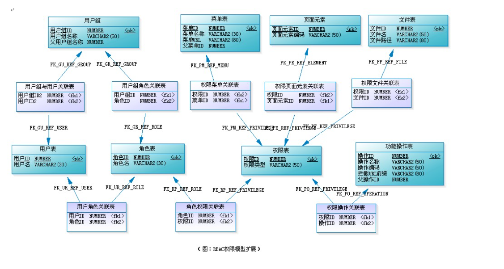

***
	RBAC认为授权实际就是who，what，how三者之间的关系，即who对what进行how的操作。Who,权限的拥有者或主体（如Principal、User、Group、Role、Actor等等）；
	what,权限针对的对象或资源（Resource,Class);
	How,具体的权限（Privilege,正向授权与负向授权），简单的说就是我们拖过个给角色授权，然后将附有权利的角色施加到某个用户上，这样用户就可以实施相应的权利了。通过中间角色的身份，使权限管理更加灵活；角色的权利可以灵活地改变了，用户角色的身份可以随着场所的不同而发生改变，这样这套RBAC就几乎可以运用到所有的权限管理的模块上了。
####RBAC的分类
	1. 核心RABC0:这是权限管理的核心部分，其他的版本都是建立在0的基础上的（最基本的用户-角色-权限模型）
	
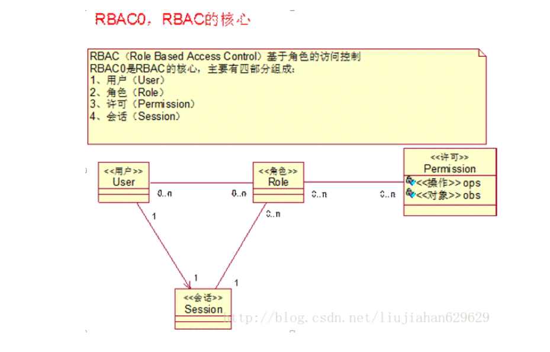
	
	通常情况下，RBAC0模型就可以解决权限模型，是最通用的。图中描述了
		1，用户和角色是多对多的关系，表示一个用户在不同的场景下可以拥有不同的角色，例如项目经理也可以是架构师等；当然一个角色也可以给多个用户，例如一个项目中多个组长等。
		需要注意的是：用户和许可进行分离，是彼此相互独立，使权限的授权认证更加灵活。
		2. 角色和许可（权限）是多对多的关系，表示角色可以拥有多分权利，同一个权利可以授给多个角色都是非常容易理解的，在现实生活中，当官级别不同权限不同的情景，其实这个模型就是对权限这方面的一个抽象，联系生活就非常容易了。
	
**表的设计：**
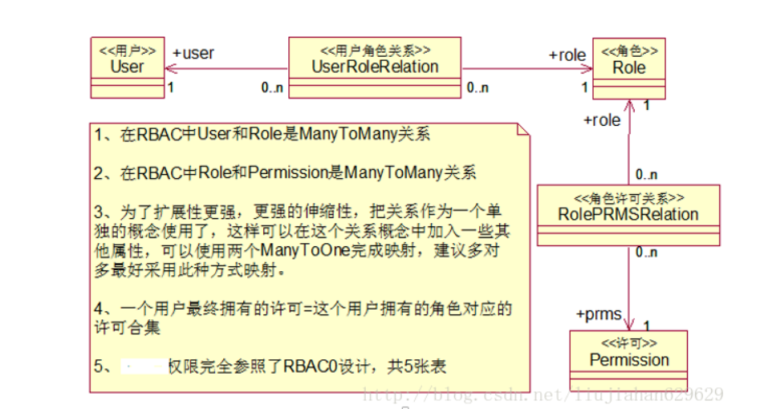

	2. 角色分级模型RBAC1，基于RBAC0模型，进行了角色的分层，也就是说角色上有了上下级的区别，存在了继承包含关系，也就是前边说过的适合于用树展现的哪种自关联的结构，这种模型合适于角色之间的层次明确，包含明确。但是认为用第一种模型也是可以的，只不过第一种可能会有数据冗余，没有这种更加面向对象化而已。(在RBAC0的基础上加入了子角色，引入了继承，子角色可以继承父角色的所有权限。)

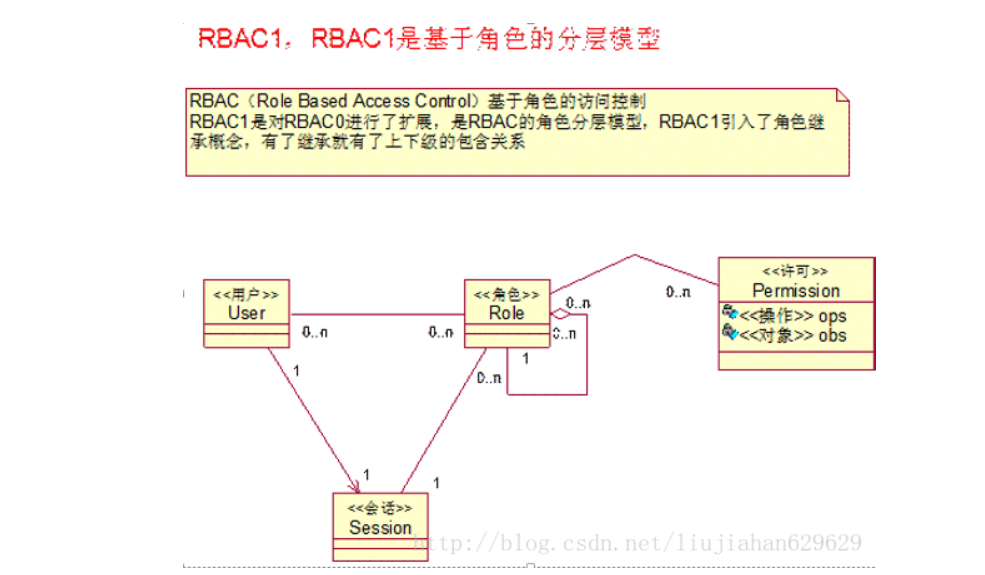

	 3. 角色限制模型RBAC2，也是基于RBAC0模型的基础上，进行了角色的访问控制。a,RBAC2中的一个基本限制时互斥角色的限制，互斥角色是指各自权限互相制约的两个角色。对于这类角色一个用户在某一次活动中只能被分配其中的一个角色，不能同时获得两个角色的使用权。常举的例子：在审计活动中，一个角色不能同时被指派给会计角色和审计员角色；b,是指角色的权利权利是有限的，用户有用的角色也是有限的，当然分配用户时也是有限的，不能进行无限制的分配用户，例如公司的领导人有限的；c,是指要想获得较高的权限，要首先拥有低一级的权限。就像我们生活中，国家主席是从副主席中选举的一样。看一下它的类图吧：(增加了对角色的一些限制：
       角色互斥：不能为同一用户分配两个互斥的角色；
       基数约束：某一角色对应的用户数量受限，分配得到该角色的用户数不能超过某个特定值，比如公司的副总不能超过多少人；
       先决条件角色：要想获得高级别权限，首先得拥有低级别的权限；
       运行时互斥：一个用户具有多个角色时，某些角色不可在运行过程中同时激活。)

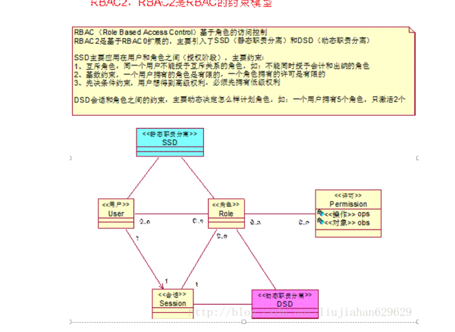

	 4. 同一模型RBAC3，也就是最全面级的权限管理，它是基于RBAC0的基础上，将RBAC1和RBAC2进行整合了，最前面，也最复杂的：

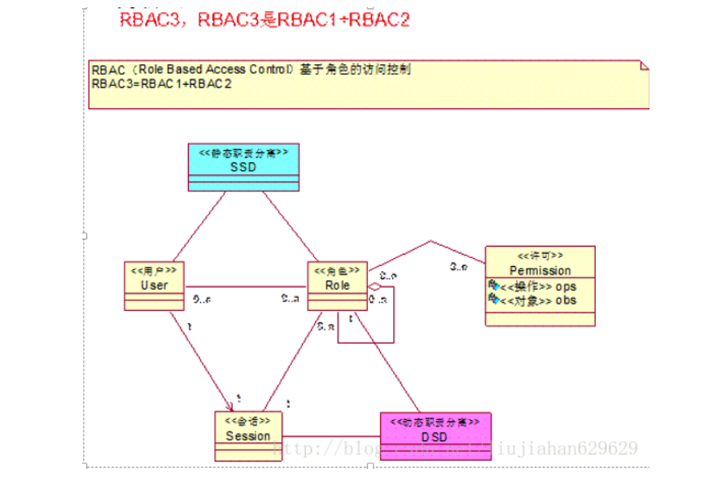

####RBAC支持的公认安全原则：最小特权原则、责任分离原则和数据抽象原则
1. 最小特权原则得到支持，是因为RBAC模型中可以通过限制分配给角色权限的多少和大小来实现，分配给与某用户对应的角色的权限只要不超过该用户完成其任务的需要就可以了。
2. 责任分离原则的实现，是因为RBAC模型中可以通过在完成敏感任务过程中分配两个责任上互相约束的两个角色来实现，例如清查账目时，只需要设置财务管理员和会计两个角色参加就可以了。
3. 数据抽象原则是借助抽象许可权这样的概念实现的，如在账目管理活动中，可以使用信用、借方等抽象许可权，而不是使用操作系统提供的读、写、执行的那个具体的许可权。但RBAC并不强迫实现这些原则，安全管理员可以允许配置RBAC模型使他不支持这些原则。因此，RBAC支持数据抽象程度与RBAC模型的实现细节有关。

####一个系统的权限分类：
	功能权限：指系统的模块、页面、按钮、文本、元素等根据用户所具有的权限决定是否进行显示。
	数据权限：指在页面中要显示的数据，针对不同用户显示的数据不同，比如公司不同部门所能查看的文件列表不同。
	操作权限：用户在系统中进行的素有动作、交互。

****
****
###12/5/2019 3:07:52 PM 
####[ER模型](https://blog.csdn.net/lvshihua/article/details/24185329)
#####1.什么是ER模型
	实体-联系图(Entity-RelationDiagram)用来建立数据模型，在数据库系统概论中数据概念设计阶段，形成一个独立于机器，独立于DBMS的ER图模型。通常将它简称为ER图，相应的可把ER图描绘的数据模型成为ER模型。
#####2.为什么出现ER模型
	如果把用户信息需求得到的数据存储格式转换成DBMS能处理的逻辑模型，这样往往被 牵扯到更多的细节限制方面，而不能集中在最重要的信息组织结构和处理模型上。当外界环境发生变化时，设计结果就难以适应这个变化。为了改善这种情况，在需求分析阶段和逻辑设计之间增加了概念设计阶段，从用户角度看待数据及处理需求和约束，而后产生一个反应用户观点的概念模型，在概念模型设计中，最著名的方法就是ER方法，它接近于人的思维，容易理解，与计算机无关，用户容易接受。
#####3.ER
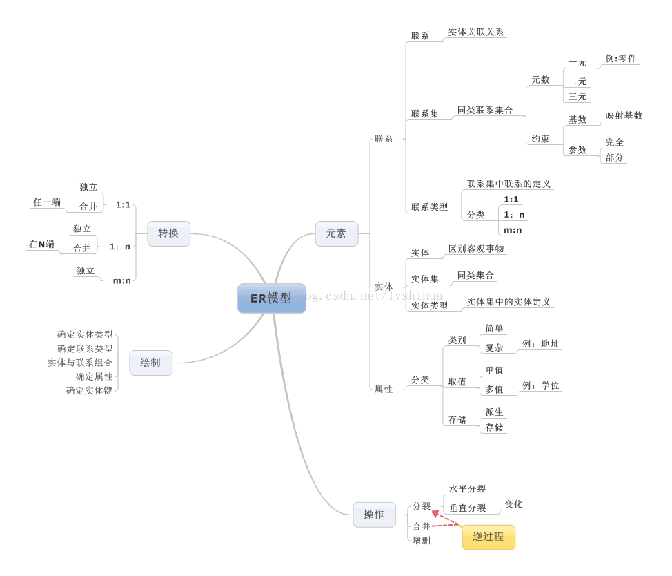

	实体：一个数据对象，指应用中可以区别的客观存在的事物。例如：小狗
	联系：表示一个或多个实体之间的关联关系。例如：老师与学生之间存在着授课关系。
	属性：实体的某一个特性称为属性。例如：某个人的姓名，年龄等。
	完整ER模型图如下：
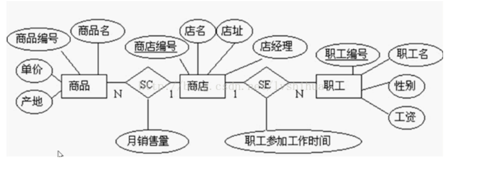

####4.总结
	ER模型被广泛应用在概念设计中，在软件开发的需求分析阶段，我们从用户的需求出发，对数据进行抽象，绘制ER图，这样一方面有效控制设计的复杂度，一方面可以更容易与用户交流

*****
###12/6/2019 4:40:34 PM 
####内连接比左连接快的原因
	至于left为什么比inner快。 是因为left时， 数据库在执行时， left左边的表是被优化执行的，因为left左边的表被无条件返回， left边的表对结果集不存在影响。 但是inner的时候， 就需要对数据进行过滤。 所以速度会慢。

####连接查询比子查询快的原因
	1 因为子查询会多次遍历所有的数据（视你的子查询的层次而定），而连接查询只会遍历一次
	2 执行子查询时，MYSQL需要创建临时表，查询完毕后再删除这些临时表，所以，子查询的速度会受到一定的影响，这里多了一个创建和销毁临时表的过程
	3 表关联的效率要高于子查询，因为子查询走的是笛卡尔积

>>笛卡尔乘积是指在数学中，两个集合X和Y的笛卡尔积（Cartesian product），又称直积，表示为X × Y，第一个对象是X的成员而第二个对象是Y的所有可能有序对的其中一个成员 [1] 。

####[什么是sql执行计划 EXPLAIN](http://www.wltbk.com/An/MySQL%E7%9A%84SQL%E6%89%A7%E8%A1%8C%E8%AE%A1%E5%88%92%20-%20%E7%AE%80%E4%B9%A6.html)
[union的使用](https://www.w3school.com.cn/sql/sql_union.asp)
	1. sql执行计划
		就是用EXPLAIN分析一条sql语句时展示出来的那些信息
	
		id:
			id相同:执行的顺序由上而下
			id不同:如果是子查询，id的序号会递增，id值越大优先级越高，越下呗执行。
			id相同又不同（两种情况同时存在）：id如果相同，可以认为是一组，从上往下顺序执行;在所有组中，id值越大，优先级越高，越先执行

		select_type(查询的类型)
			1. simple:简单的select查询，查询中不包含子查询或者union
			2. primary:查询中包含任何复杂的子部分，最外层查询则被标记为primary
			3. subquery:在select或where列表中包含了子查询
			4. derived:在from列表中包含的子查询被标记为derived（衍生）,mysql或递归执行这些子查询，把结果放在零时表里
			5. union:若第二个select出现在union之后，责备标记为union;若union包含在from子句的子查询中，外层select将被标记为derived
			6. union result:从union表获取结果的select

		type
			访问类型，结果值从好到坏依次是：
			system const eq_ref ref fulltext ref_or_null index_merge     unique_subquery index_subquery range index All
			好的sql查询至少达到range，最好达到ref

			1. system: 表只有一行记录（等于系统表），这是const类型的特例，平时不会出现，可以忽略不计
			2. const: 表示通过索引一次就找到了，const用于比较primary key 或者 unique索引。因为只需匹配一行数据，所以很快。如果将主键置于where列表中，mysql就能就能将该查询转换为一个const	
			3. eq_ref:唯一性索引扫描，对于每个索引键，表中只有一条记录与之匹配。常见于主键或唯一索引扫描。
			4. ref:非唯一性索引扫描，返回匹配某个单独值的所有行。本质是也是一种索引访问，它返回所有匹配某个单独值的行，然而他可能会找到多个符合条件的行，所以它应该属于查找和扫描的混合体
			5. range:只检索给定范围的行，使用一个索引来选择行。key列显示使用了那个索引。一般就是在where语句中出现了bettween、<、>、in等的查询。这种索引列上的范围扫描比全索引扫描要好。只需要开始于某个点，结束于另一个点，不用扫描全部索引
			6. index:Full Index Scan，index与ALL区别为index类型只遍历索引树。这通常为ALL块，应为索引文件通常比数据文件小。（Index与ALL虽然都是读全表，但index是从索引中读取，而ALL是从硬盘读取）
			7. ALL:Full Table Scan，遍历全表以找到匹配的行

		possible_keys
			查询涉及到的字段上存在的索引，则该索引将被列出，但不一定被查询实际使用

		key
			实际使用的索引，如果为null，则没有使用索引
			查询中如果使用了覆盖索引，则该索引仅出现在key列表中

		key_len
			表示索引中使用得当字节数，查询中使用的索引长度（最大可能长度），并非实际使用长度，理论上长度越短越好。key_len是根据表定义计算而得的，不是通过表内检索的
		
		ref
			显示索引的那一列被使用了，如果可能，是一个常量const。

		rows
			根据表统计的信息及索引选用的情况，大致估算出找到所需的记录所需要读取的行数	
		
		Extra
			不适合在其他字段，但是十分重要的额外信息
			1. Using filesort;
				mysql对数据使用一个外部的索引排序，而不是按照表内的索引进行排序读取。也就是说mysql无法利用索引完成的排序操作成为“文件排序”
			2. Using temporary:
				使用临时表保存中间结果，也就是说mysql在对查询结果排序时使用了临时表，常见于order by和group by
			3. Using index:
				表示相应的select操作中使用了覆盖索引（Covering Index），避免了访问表的数据行，效率高如果同时出现Using where，表明索引被用来执行索引键值的查找（参考上图）如果没用同时出现Using where，表明索引用来读取数据而非执行查找动作
				
				覆盖索引（Covering Index）：也叫索引覆盖。就是select列表中的字段，只用从索引中就能获取，不必根据索引再次读取数据文件，换句话说查询列要被所建的索引覆盖。
				注意：
					a、如需使用覆盖索引，select列表中的字段只取出需要的列，不要使用select *
					b、如果将所有字段都建索引会导致索引文件过大，反而降低crud性能
			4. Using where:
				使用了where过滤
			5. Using join buffer
				使用了链接缓冲
			6. Impossible WHERE:
				where子句的值总是false,不能用来获取任何元祖
			7. select tables optimized away:
				在没有group by子句的情况下，基于索引优化MIN/MAX操作或者对于MyISAM存储引擎优化COUNT（*）操作，不必等到执行阶段在进行计算，查询执行计划生成的阶段即可完成优化
			8. distinct:
				优化distinct操作，在找到第一个匹配的元祖后即停止找同样值得动作

####sql语句优化
    1. 在进行表格查询时 , 列名列表应避免使用*号 , 数据库在执行查询操作时, 会先将*号展开(将*转换为所有的列名) , 再进行查询操作.
    2. 在进行表格查询时, 能使用where条件筛选的数据, 应尽量避免使用having子句筛选! 因为where条件执行在having之前 . 尽早的筛除掉大量的数据, 可以显著的提高查询语句的性            能.
    3. 在进行多表查询时, 查询的表顺序是从右至左的 , 应把表中数据量最少的表 放在查询的最右边.
    4. 在进行多表查询时, 应尽可能给所有的表格添加别名 , 能明确的区分有冲突的列.
    5. 在使用事务时 , 应尽量多的commit , 尽量早的commit ! 原因是: 事务未提交时, 数据库会耗费大量的内存, 来缓存未提交的SQL结果.
    6. 尽可能多的使用函数 来提交SQL执行的效率.
    7. SQL语句编写时, 除字符串以外, 应使用大写字母 ,因为SQL语句执行时, 会先将小写字母 ,转换为大写字母!再执行.+
    8. 应尽可能少的访问数据库. (多次访问数据库的结果 有时是相同的, 如果将结果缓存起来, 可以显著的提高程序的性能)
    9. 在索引列上 , 一定要避免使用not来做条件判断. 如果使用了not关键字判断索引列, 会导致此次查询索引失效 . 转而使用全表扫描的方式来查询
    10. 在索引列上 , 不能使用算数运算 , 算数运算也会导致本次查询索引失效. 转而使用全表扫描的方式来查询
    11. 在查询数据时 , 如果需要使用>或<进行条件判断 , 应替换为>= 或 <= 原因是, 数据库内部在操作>和<时,  是按照>=  和 <= 来查询的 , 然后再撇去=的结果, 得到了>或<的节结果 .

####sql常用的优化方式
	1. 服务器硬件
	2. MySql服务器优化
	3. SQL本身优化
	4. 反范式设计优化
		反范式化设计是针对范式化而言的
		所谓的反范式化就是为了性能和读取效率的考虑而适当得对数据库设计范式要求进行违反
		允许存在少量得冗余，换句话来说反范式化就是使用空间来换取时间
		简单的查询不一定能带来优化，因为有数据冗余。 
	5. 物理设计优化（字段类型、长度设计、存储引擎选择）
		为表中的字段选择合适的数据类型
			当一个列中可以考虑多种数据类型时
				1. 优先考虑数字类型
				2. 其次是日期、时间类型
				3. 最后是字符类型
				4. 对于相同级别的类型，应该选择占用空间小的数据类型
	6. 索引优化
		索引是帮助MySql高效获取数据的数据结构
		索引的本质：索引是数据结构

>mysql默认存储引擎innodb只显式支持B-Tree(从技术上来说是B+Tree)索引

		索引的分类
			普通索引：即一个索引只包含单个列，一个表可以有多个单列索引
			唯一索引：索引列的值必须唯一，但允许有空值
			复合索引：即一个索引包含多个列

			聚簇索引（聚集索引）：并不是一种单独的索引类型，而是一种数据存储方式。具体细节取决于不同的实现，InnoDB的聚簇索引其实就是在同一个结构中保存了B-Tree索引（技术上来说是B+Tree）和数据行。
			非聚簇索引：不是聚簇索引，就是非聚簇索引
			show global variables like "%datadir%";