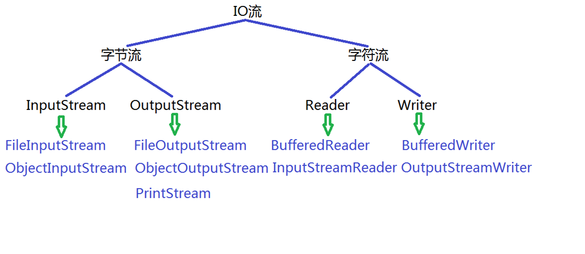

###12/3/2019 10:52:25 AM 
###Focus only on the present, never dwelling on the past.
**活在当下吧。**
##
IO流

###File类
	java.io.File用于表示文件和目录，通过File在程序中操作硬盘上的文件和目录。
	File类只用于表示文件和目录的属性信息（名称、大小等），不能对文件内容进行访问。
	File类中常用的方法如下：
		File(String pathname)	根据参数指定的路径名来构造对象
		boolean exists()	测试此抽象路径名表示的文件或目录是否存在
		boolean delete()	用于删除文件，当删除目录时要求是空目录
		boolean createNewFile()		用于创建新的空文件
		boolean mkdir()		用于创建目录
		boolean mkdirs		用于创建多级目录
###I/O流
	1. 基本概念
		I/O就是Input/Output的简写，也就是输入/输出的含义。
		I/O就是指读写数据时像流水一样不间断，因此得名"流"
	2. 基本分类
		根据数据读写的单位不同分为：字节流 和 字符流
		其中字节流主要指一字节为单位进行读写的流，可以读写任意类型的文件；
		其中字符流主要指以字符(2个字节)为单位进行读写的流，只能读写文本文件

		根据数据流动的方向不同分为： 输入流 和 输出流（站在程序的角度）
		其中输入流主要指将数据从文件输入的程序中，也就是读取文件中的内容；
		其中输出流主要指将数据从程序输出到文件中，也就是写入到文件中；

		节点流和包装流
		节点流：将文件想象成水桶，将流想象成水管，水管直接接入水桶就是节点流（假设有一个文件，有一个流，这个流直接和文件关联，这就是节点流）
		包装流：如果水管需要经过别的水管才能进入水桶，这就是包装流

####FileOutputStream类
	1. 基本概念
		java.io.FileOutputStream类主要用于将图像数据之类的原始字节流写入到输出流中
	2. 常用方法
		常用的构造方法如下：
			FileOutputStream(String name)
			-根据参数指定的文件名来构造对象
			FileOutputStream(String name,boolean append)
			-表示以追加的方式根据参数指定的文件名来构造对象
		常用的成员方法如下：
			void write(int b)	将指定字节写入此文件输出流
			void write(byte[] b,int off,int len)	将指定字节数组中从偏移量off开始的len个字节写入此文件输出流
			void write(byte[] b)	将b.length个字节从指定字节数组写入此文件输出流中
			void close()	用于关闭文件输出流并释放有关的资源

>>如果文件不存在， 该流会自动创造该文件。
>String -> Bytes  "hello".getBytes()
####FileInputStream类
	1. 基本概念
		java.io.FileInputStream类主要用于输入流中读取图像数据之类的原始字节流。
	2. 常用的构造方法
		FileputStream(String name)
		-根据参数指定的文件路径名来构造对象。
	3. 常用的成员方法：
		in read()	读取一个byte无符号填充到int第八位，-1是EOF
		int read(byte[] b)	从此输入流中将最多b.length个字节的数据读入一个字节数组中，返回读取的字节的个数
		int read(byte[] b,int off,int len)	从此输入流中将最多len个字节的数据读入一个字节数组中，从下标off出开始读
		void close()	用于关闭文件输出流并关闭有关资源

####文件的拷贝
	方式一：
		//构造FileInputStream类型对象与C:/a.txt关联
		FileInputStream fis = new FileInputStream("c:/a.txt");
		//构造FileOutputStream类型的对象与c:/b.txt相关联
		FileOutputStream fos = new FileOutputStream("c:/b.txt");
		//不断地从输入流中读取数据内容并写入到输出流中
		System.out.println("正在玩命拷贝中");
		int res = 0;
		while((res = fis.read())!=-1){
			fos.write(res);
		}
		System.out.println("拷贝成功");
		//关闭流并释放有关资源
		fis.close()
		fos.close()
>>一般先打开的流后关闭，后打开的流先关闭  
> 缺点：当文件稍大时，则拷贝文件的效率极低

	方式二：
		 准备一个和文件大小一样的缓冲区，一次性读满再一次性写完
		int len = fis.available();
		System.out.println("获取到的文件大小是:"+len)
		byte[] bArr = new byte[len];
		//一次性的将输入流关联文件的所有内容读取出来
		int res = fis.read(bArr);
		System.out.println("实际读取到的文件大小是:"+res);
		//一次性将所有内容写入到输出流中
		fos.write(bArr);
		System.out.println("拷贝文件成功！“）;
		//关闭流对象并释放有关资源
		fos.close();
		fis.close();
>>缺点：当文件过大时，无法申请和文件大小一样的缓冲区，真实物理内存不足

	方式三：
		//准备一个合适的缓冲区，每次将缓冲区读满，但读很多次
		byte[] bArr = new byte[1024*8];
		int res = 0;
		while((res = fis.read(bArr)) != -1){
			//fos.write(bArr);
			这种方式最后一次读取的时候不能有多少读多少
			建议以下方式：
			fos.write(bArr,0,res);
		}
		System.out.println("拷贝文件成功");
		//关闭流并释放有关资源
		fos.close();
		fis.close();
***
####PrintStream类
	1. 基本概念
		java.io.PrintStream类主要用于方便地打印各种数据内容并且自动刷新。
		自动刷新（抽象解释：文件和流相当于水桶和水管关系，当水管中的水流入到水桶中时，会有水渍留下，自动刷新相当于将这些水渍刷到水桶中）
	2. 常用的构造方法如下：
		PrintStream(OutputStream out)-根据参数指定引用来构造对象。
		-其中OutputStream类是个抽象类，实参需要传递子类的对象。
	3. 常用的成员方法：
		void print(String s)	用于将参数指定的字符串内容打印出来
		void println(String x)	用于打印字符串后终止改行
		void close()	用于关闭文件输出流并释放有关的资源
	4. 例子
		//构造printStream类型的对象与c:/a.txt文件关联
		PrintStream ps = new PrintStream(new FileOutputStream("c:/a.txt")) 
		ps.print("hello);//单纯的写入字符串
		ps.println("hello")//写入并终止改行，也就是换行 2个字节
		System.out.println("写入数据成功!");
		//关闭流并释放有关对象
		ps.close();

####BufferedReader类
	1. 基本概念
		java.io.BufferedReader类主要用于读取单个字符，字符数组以及一行字符串。
	2. 常用的构造方法
		BufferederReader(Reader in)=根据参数指定的引用来构造对象。
		-其中Reader类是个抽象类，实参需要传递子类的对象。
	3. 常用的成员方法
		String readLine()	用于读取一行字符串并返回
		void close()	用于关闭文件输出流并释放有关资源
		int	read()	读取单个字符
	4. 例子
		//构造BufferedReader类型的对象与c:/a.txt文件关联
		BufferedReader br = new BufferedReader(new InputStreamReader(new FileInputStream("c:/a.txt")));
		/*
		int res = 0;
		//读取单个字符
		while((res = br.read())!=-1){
			System.out.println("读取到的字符是:"+(char)res+",对应的ASCII是："+res);
		}
		*/
		//从输入流中读取一行字符串，遇到行终止符读取停止
		String str1 = br.readLine();
		System.out.println("读取到的字符串是："+str1);
		//用于关闭流并释放有关资源
		br.close();
####BufferedWriter类
	1. 基本概念
		java.io.BufferedWriter类主要用于向输出流中写入单个字符、字符数组以及字符串
	2. 常用的方法
		构造方法如下：
			BufferedWriter(Writer out) -根据参数指定的引用来构造对象
			-其中Writer是个抽象类，实参需要传递子类的对象。
			BufferedWriter(Writer out,int sz)	创建一个使用给定大小输出缓冲区的新缓冲字符输出流
		成员方法：
			void write(int c)	用于写入单个字符到输出流中
			void write(char[] cbuf,int off,int len)	用于将字符数组cbuf从下标off开始的len个字符写入到输出流中
			void write(char[] cbuf)	用于将字符串数组cbuf中的所有内容吸入输出流
			void write(String str)	用于将参数指定的字符串内容写入输出流中
			void newLine()	用于写入行分隔符到输出流中
			void close()	关闭流，并释放有关资源
	3. 例子
		//构造BufferedWriter类型的对象与c:/a.txt文件关联
		BufferedWriter bw = new BufferedWriter(new OutputStreamWriter(new FileOutputStream("c:/a.txt")));
		//向输出流中写入单个字符，字符数组以及字符串
		//写入单个字符
		bw.write('a');
		char[] cArr = {'h','e','l','l','o'};
		//将cArr中下标从1开始的2个字符写入输出流
		bw.write(CArr,1,2);el
		//将cArr整个数组中所有内容吸入输出流
		bw.write(cArr);//hello
		//将整个字符串写入到输出流
		bw.write("world");
		//将行分隔符写入输出流中
		bw.newLine();//换行符
		System.out.println("写入数据成功");
		//关闭流对象
		bw.close();
		 
****
####ObjectOutStream类
	1. 基本概念
		java.io.ObjectOutputStream类主要用于将Java语言中的对象整体写入输出流中。 
		只能将支持 java.io.Serializable接口的对象写入流中，也就是说被写入对象的数据类型必须实现该接口。
		类通过实现java.io.Serializable接口以启用其序列化功能。
		所谓序列化功能主要指将一个对象需要保存的所有相关信息有效的组织成字节序列的的转化过程。
	2. 常用的方法：
		ObjectOutputStream(OutputStream out)	根据参数指定引用来构造对象，其中OutputStream类是个抽象类，因此实参需要传递子类对象
		void writeObject(Object obj)	用于将参数指定的对象整体写入到输出流中
		void close()
		用于关闭文件输出流并释放有关的资源

>序列化：字节序列转化过程

	3. 例子
		1. 封装一个Student类，实现Serializable接口
		//构造ObjectOutputStream类型的对象与c:/a.txt文件相关联
		ObjectOutputStream oos = new ObjectOutputStream(new FileOutputStream("c:/a.txt"));
		//准备Student类型的对象并初始化
		Student ts = new Student(1001,"zhangfei",30);
		//将Student类型的对象整体写入到输出流中
		oos.writeObject(ts);
		System.out.println("写入对象成功!");
		//关闭流并释放有关资源
		oos.close();

####ObjectInputStream类
	1. 基本概念
		java.io.ObjectInputStream类主要用于从输入流中将一个对象整体读取出来。
		所谓反序列化主要指将有效组织的字节序列恢复为一个对象及相关信息的转化过程。
	2. 相关的方法
		ObjectInputStream(InputStream in)	根据参数指定的引用来构造对象
		其中InputStream类是抽象类，实参需要传递子类的对象
		Object readObject()		主要用于从输入流中读取一个对象并返回
		无法通过返回值来判断是否读取的文件的末尾
		void close()	 用于关闭文件输出流并释放有关的资源
	3. 例子
		//构造ObjectInputStream类型的对象与c:/a.txt文件关联
		ObjectInputStream ois = new ObjectInputStream(new FileInputStream("c:/a.txt");
		//从输入流中读取一个对象并打印出来
		Student ts = (Student)ois.readObject();
		System.out.println("读取到的对象： "+ts);
		//关闭流并释放对象
		ois.close();

>>经验的分享：  当需要向文件汇总写入多个对象时，可以先将多个对象放入一个集合中，然后将集合这个整体看做一个对象调用一次writeObject方法整体写入文件，此时只需要调用一次readObject方法就可以将整个结合读取出来。

####transient关键字
	transient是Java语言的关键字，用来表示一个域不是该对象串行化的一部分。当一个对象呗串行化的时候，transient型变量不包括在串行化的表示中，然而非transient型的变量是被包括进取的。

****

####DataOutputStream类
	1. 基本概念
		java.io.DataOutputStream类主要用于以适当的方式将基本数据类型写入到输出流中。
	2. 常用的方法
		DataOutputStream(OutputStream out) - 根据参数指定的引用构造对象。
			-其中OutputStream类是个抽象类，实参需要传递子类的对象
		void writeInt(int v) - 用于将参数指定的整数一次性写入输出流，优先写入高字节。
			- 200： 0000 0000	0000 0000	0000 0000	1100 1000
				高					=>				低
		void close()
	3. 例子
		//构造DataOutputStream类型的对象与c:/a.txt关联
		DataOutputStream dos = new DataOutputStream(new FileOutputStream("c:/a.txt"));
		//准备一个int类型的变量，将该变量的数值写入到输出流中
		int num = 66;
		dos.writeInt(num);	//用于一次性写入4个字节
		dos.write(num);	//用于一次性写入一个字节，默认值写入地委
####DataInputStream类
	1. 基本概念
		java.io.DataInputStream类主要用于从输入流中获取基本数据类型的数据。
	2. 常用的方法
		DataInputStream(InputStream in) - 根据参数的引用来构造对象。
			-其中InputStream类是个抽象类，实参需要传递子类的对像。
		int readInt()	- 用于从输入流中一次性读取一个整数数据并返回。
		void close()
	3. 例子
		//构造DataInputStream类型的对象与c:/a.txt文件关联
		DataInputStream dis = new DataInputStream(new FileInputStream("c:/a.txt"));
		//从输入流中读取一个整数并打印出来
		int num = dis.readInt();//一次性读取4个字节
		int num = dis.read();//一次性读取1个字节
		System.out.println("读取到整数数据："+num);
		dis.close();
>>可能抛出的异常  
>EOFException当输入过程中意外到达文件或流的末尾时，抛出此异常。 

此异常主要被数据输入流用来表明到达流的末尾。注意，其他许多输入操作返回一个特殊值表示到达流的末尾，而不是抛出异常。 

#####DIS和DOS的概述
	DataOutputStream和DataInputStream是对“流”功能的扩展，可以更方便的读取int,long,字符等类型数据。
	DataOutputStream对基本的输出流功能扩展，提供了基本的数据类型输出方法，也就是基本类型是序列化的方法
	DataInputStream是对基本输入流（InputStream）功能的扩展，它提供基本类型的输入方法，就是基本类型的反序列化。