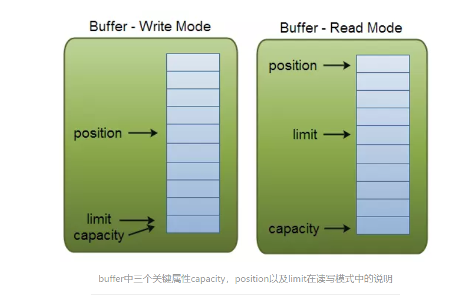

####12/2/2019 8:06:06 PM 
###Beauty is found everywhere. Our eyes do not show a lack of sense of beauty, but a lack of observation.
**世界上不是缺少美，而是缺少发现美的眼睛。**
***
##[任务：使用NIO技术实现目录内容的复制](https://www.jianshu.com/p/362b365e1bcc)
####什么是NIO？
	java.nio全称java non-blocking IO(实际上是new io),是指JDK1.4及以上的版本里听的新api(New IO),为所有的原始类型（boolean类型除外)提供缓存支持的数据容器，使用它可以提供非阻塞式的高伸缩性的网络。

	HTTP2.0使用了多路复用的技术，做到同一个连接并发处理多个请求，而且并发请求的数量比HTTP1.1大了好几个数量级。

>>>多路复用－指在同一传输介质上同时传输多个不同信号源发出的信号,并且信号之间互不影响.目的是提高介质的利用率.
####IO和NIO的区别
	原有的IO是面向流的、阻塞的，NIO则是面向块的，非阻塞的。
####怎么理解IO是面向流的、阻塞的
	java1.4以前的io模型，一连接对一个线程。
	原始的IO是面向流的，不存在缓存的概念。java IO面向流意味着每次从流中读一个或多个字节，直至读取所有字节，它们没有被缓冲在任何地方。此外，它不能前后移动流的数据。如果需要前后移动从流中读取的数据，需要先将它缓存到一个缓冲区。
	Java IO的各种流是阻塞的，这意味着当一个线程调用read或write方法时，该线程被阻塞，直到有一些数据被读取，或数据完全写入，该线程在此期间不能再干任何事情了。

    
####怎么理解NIO是面向块的，非阻塞的
	NIO是面向缓冲区的。数据读取到一个它稍后处理的缓冲区，需要时可在缓冲区中前后移动，这就增加了处理过程中的灵活性。

	Java NIO的非阻塞模式，使一个线程从某通道发送请求读取数据，但是它仅能得到目前可用的数据，如果目前没有数据可用时，就什么都不会获取，而不是保持线程阻塞，所以直至数据变的可以读取之前，该线程可以继续做其他的事情。非阻塞写也是如此，一个线程请求写入一些数据到某通道，但不需要等待它完全写入，这个线程同时可以去做别的事情。
	通俗理解：NIO是可以做到用一个线程来处理多个操作的。假设有10000个请求过来，根据实际情况，可以分配50或者100个线程来处理，不像之前阻塞IO那样，非得分配10000个。
####NIO的核心实现
	在标准的IO API中，你可以操作字节流，字符流，但在新IO中，你可以操作通道和缓冲，数据总是从通道被读取到缓冲中或者从缓冲写入到通道中。 
	NIO核心API Channel,Buffer,Selector

#####通道Channel
######最初IO接口都是由cpu控制的，当产生大量的读写请求时，cpu没空处理其他事情，导致性能降低

######DMA直接存储器存储，当发生读写请求时，DMA向cpu申请许可，之后由DMA全权处理.也就是IO流的形式。不过当产生大量的读写请求时，DMA会产生大量的DMA总线，DMA总线过多会造成一种总线冲突，也会影响性能。

######通道Channel是一个完全独立的处理器，专用于IO操作。相对于流，减少了cpu的请求，利用率更高。

 
	通道是面向缓冲区的,通道相当于铁路，缓冲区相当于火车。

	通道：
		用于源节点与目标节点的链接。在Java NIO中负责缓冲区中数据的传输。Channel本身不存储数据，因此需要配合缓冲区进行传输。
	通道的主要实现类
		java.nio.channels.Channel 接口：
			|--FileChannel
			|--SocketChannel	tcp
			|--ServerSocketChannel	tcp
			|--DatagramChannel	udp
	获取通道
		1. java针对支持通道的类提供了getChannel()方法
			本地IO:
			FileInputStream/FileOutputStream
			RandomAccessFile
				
			网络IO:
			Socket
			ServerSocket
			DatagramSocket
		2. 在JDK1.7中的NIO.2针对各个通道提供了静态方法open()
		3. 在JDK1.7中的NIO.2的Files工具类的newByteChannel()

	NIO的通道类似于流，有些区别如下：
		1. 通道可以同时进行读写，而流只能读或者只能写
		2. 通道可以实现异步读写数据（异步处理不用阻塞当前线程来等待处理完成，而是允许后续操作，直至其它线程将处理完成，并回调通知此线程）
		3. 通道可以从缓冲读数据，也可以写数据到缓冲
		

#####缓冲Buffer
	获取缓冲区：
		static ByteBuffer allocate(int capacity) 
          分配一个新的字节缓冲区。 

	缓冲区本质上是一个可以写入数据的内存块，然后可以再次读取，该对象提供了一组方法，可以更轻松地使用内存块，使用缓冲区读取和写入通常遵循以下四个步骤：
		1. 写数据到缓冲区；
		2. 调用buffer.flip()方法；
		3. 从缓冲区读取数据；
		4. 调用buffer.clear()或buffer.compat()方法；
	当向buffer写入数据时，buffer会记录下写了多少数据，一旦要读取数据，需要通过flip()方法将Buffer从写模式切换到读模式，在读模式下可以读取之前写入到buffer的所有数据，一旦读完了所有的数据，就需要清空缓冲区，让它可以再次被写入。

	Buffer在于Channel交互时，需要一些标志：
	 Buffer mark() 
          在此缓冲区的位置设置标记。 
	
	缓冲区四个核心属性：
		capacity:容量，表示缓冲区中最大存储数据的容量。一旦声明不能改变
		limit:界限，表示缓冲区中可以操作数据的大小。（limit后数据不能进行读写）
		position:位置，表示缓冲区中正在操作数据的位置。
		mark:标记，表示记录当前position的位置。可以通过reset()恢复到mark的位置。
		0<=mark<=position<=limit<=capacity
	
	在写模式下，缓冲区的limit表示你最多能往Buffer里写多少数据；读模式下，limit等于Buffer的capacity,意味着你还能从缓冲区后去多少数据

	不变式：
		标记、位置、限制和容量值遵守以下不变式：
			0<=标记<=位置<=限制<=容量
		新创建的缓冲区总有一个0位置和一个未定义的标记。初始限制可以为0，也可以为其他值，这取决于缓冲区的类型以及其构建方式。一般情况下，缓冲区的初始内容是未定义的。		
	下图展示了buffer中三个关键属性capacity,position以及limit在读写模式中的说明：

	缓冲区常用的操作
		向缓冲区写数据
			1. 从Channel写到Buffer;
			2. 通过Buffer的put方法写到Buffer中；
		从缓冲区读取数据：
			1. 从Buffer中读取数据到Channel；
			2. 通过Buffer的get方法从Buffer读取数据；
		flip方法：
			将Buffer从写模式切换到读模式，将position重置为0，limit的值设置为之前position的值；
		clear方法 vs compact方法：
			clear方法清空缓冲区；compact方法只会清空已读取的数据，而还未读取的数据继续保存在Buffer中；
#####Selector
	Selector 一般称 为选择器 ，当然你也可以翻译为 多路复用器 。它是Java NIO核心组件中的一个，用于检查一个或多个NIO Channel（通道）的状态是否处于可读、可写。如此可以实现单线程管理多个channels,也就是可以管理多个网络链接。

	一个组件，可以检测多个NIO channel,看看读或者写事件是否就绪。
	多个Channel以事件的方式可以注册到同一个Selector，从而达到用一个线程处理多个请求成为可能。
	使用Selector的好处在于： 使用更少的线程来就可以来处理通道了， 相比使用多个线程，避免了线程上下文切换带来的开销。

####异常摘要
	BufferOverflowException 当相关 put 操作达到目标缓冲区限制时，抛出此未经检查的异常。 
	BufferUnderflowException 当相关 get 操作达到源缓冲区限制时，抛出此未经检查的异常。 
	InvalidMarkException 当试图重置一个尚未定义其标记的缓冲区时，抛出此未检查的异常。 
	ReadOnlyBufferException 当在只读缓冲区上调用内容可变（content-mutation）的方法（例如 put 或 compact 方法）时，抛出此未经检查的异常。 

####案例

	@Test
	public void test1(){
		String str ="abcde";
		//1. 分配一个指定大小的缓冲区
		ByteBuffer buf = ByteBuffer.allocate(1024);
		System.out.println(buf.position());//位置 0
		System.out.println(buf.limit());//界限1024
		System.put.println(buf.capacity());//容量1024

		//2. 利用put()存入数据到缓冲区
		buf.put(str.getBytes());
		System.out.println(buf.position());//位置 5
		System.out.println(buf.limit());//界限1024
		System.put.println(buf.capacity());//容量1024

		//3. 切换读取数据模式
		buf.flip();
		System.out.println(buf.position());//位置 0
		System.out.println(buf.limit());//界限5
		System.put.println(buf.capacity());//容量1024
		
		//4. 利用get()读取缓冲区中的数据
		byte[] dst = new byte[buf.limit()];
		buf.get(dst);	
		System.out.println(new String(dst, 0, dst.length));
		System.out.println(buf.position());//位置 5
		System.out.println(buf.limit());//界限5
		System.put.println(buf.capacity());//容量1024

		//5. rewind():可重复读 position回到了最初的位置
		buf.rewind();
		System.out.println(buf.position());//位置 0
		System.out.println(buf.limit());//界限5
		System.put.println(buf.capacity());//容量1024

		//6. clear():清空缓冲区，但是缓冲区的数据还在，但是处于被遗忘状态(被遗忘状态：指位置，界限等回到了最初的状态，不能正确的读数据了)
		buf.clear();
		System.out.println(buf.position());//位置 0
		System.out.println(buf.limit());//界限1024
		System.put.println(buf.capacity());//容量1024
		//compact方法只会清空已读取的数据，而还未读取的数据继续保存在Buffer中；

	@Test
	public void test2(){
		String str = "abcde";
		ByteBuffer buf = ByteBuffer.allocate(1024);
		buf.put(str.getBytes());
		buf.flip();
		
		byte[] dst = new byte[buf.limit()];
		buf.get(dst,0,2);
		System.out.println(new String(dst,0,2));//ab
		System.out.println(buf.position());//2
		
		//mark():标记
		buf.mark();
		
		buf.get(dst,2,2);
		System.out.println(new String(dst,2,2));//cd
		System.out.println(buf.position());//4
		
		//reset():恢复到mark的位置
		buf.reset();
		System.out.println(buf.position());//2
		
		//判断缓冲区中是否还有剩余数据
		if(buf.hasRemaining()){
			//获取缓冲区中可以操作的数量
			System.out.println(buf.remaining());//3 
		}
	
#####直接缓冲区和非直接缓冲区
* 非直接缓冲区：通过allocate()方法分配内存，将缓冲区建立在JVM的内存中。

* 直接缓冲区：通过allocateDirect()方法分配直接缓冲区，将缓冲区建立在物理内存中。可以提高效率。(只有ByteBuffer支持)
>>缺点：分配消耗资源大，不易控制（开辟物理内存之后，只能靠操作系统控制了），只能靠垃圾回收机制回收。（System.gc 可加速回收，但不是立即执行）

	
	例子：
		@Test
		public void test3(){
			//分配直接缓冲区
			ByteBuffer buf = ByteBuffer.allocateDirect(1024);
			//用于判断是否为直接缓冲区
			System.out.println(buf.isDirect());//true
		} 

****
****
*******
****

###12/4/2019 4:54:25 PM 
####NIO文件copy的实现
	package cn.xdl.util;

	public class ByteUtil {
    private static int maxSize = 1024;
    private static byte[] arr = new byte[maxSize];
    /**
     * 返回最大容量capacity
     */
    public static int getMaxSize(){
        return maxSize;
    }
    /**
     * 修改capacity大小
     */
    public static void setMaxSize(int newSize){
        ByteUtil.maxSize = newSize;
    }
    /**
     * 返回一个byte
     */
    public static byte[] getByte(){
        return arr;
    }
    }
***
	package cn.xdl.test;

	import cn.xdl.util.ByteUtil;
	
	import java.io.*;
	import java.nio.ByteBuffer;
	import java.nio.MappedByteBuffer;
	import java.nio.channels.FileChannel;
	import java.nio.file.Paths;
	import java.nio.file.StandardOpenOption;
	import java.util.Map;
	
	public class NioCopyFile {
    //获取文件输入输出流
    private static FileInputStream fis=null;
    private static FileOutputStream fos=null;
    private static FileChannel fisChannel = null;
    private static FileChannel fosChannel = null;

    /**
     * 用非直接缓冲区实现了文件的copy
     * @throws IOException
     */
    public static void getCopyFile(String srcPath,String pastPath) throws IOException {
        try {
            fis = new FileInputStream(srcPath);
            fos = new FileOutputStream(pastPath);
            //通过流来获取通道
            fisChannel = fis.getChannel();
            fosChannel = fos.getChannel();
            //申请一块非直接缓冲区
            ByteBuffer indirectBuffer = ByteBuffer.allocate(1024);
            //将通道中的数据存入缓冲区中
            while(fisChannel.read(indirectBuffer)!=-1){
                //切换到读数据模式
                indirectBuffer.flip();
                //将缓冲中的数据写入到通道中
                fosChannel.write(indirectBuffer);
                //清空缓冲区
            //    indirectBuffer.rewind();
                indirectBuffer.clear();
             //   indirectBuffer.compact();
            }
            System.out.println("拷贝成功");
        } catch (FileNotFoundException e) {
            e.printStackTrace();
        }finally{
            if(fosChannel != null) {
                fosChannel.close();
            }
            if(fisChannel != null) {
                fisChannel.close();
            }
            if(fos != null) {
                fos.close();
            }
            if(fos != null) {
                fos.close();
            }
        }

    }

    /**
     * 用直接缓冲区实现文件的copy
     * @throws IOException
     */
    public static void getDirectCopyFile() throws IOException {
        FileChannel inChanel = FileChannel.open(Paths.get("E:\\虚拟机/ubuntu-14.04.5-desktop-i386.iso"), StandardOpenOption.READ);
        FileChannel outChanel = FileChannel.open(Paths.get("E:\\Spring\\Aaa/a.iso"), StandardOpenOption.WRITE, StandardOpenOption.READ, StandardOpenOption.CREATE_NEW);
        //内存映射
        MappedByteBuffer inMapBuffer = inChanel.map(FileChannel.MapMode.READ_ONLY, 0, inChanel.size());
        MappedByteBuffer outMapBuffer = outChanel.map(FileChannel.MapMode.READ_WRITE, 0, inChanel.size());
        //对缓冲区数据进行读写操作
        byte[] arr = ByteUtil.getByte();
        ByteBuffer byteBuffer = inMapBuffer.get(arr);
        outMapBuffer.put(arr);
        System.out.println(byteBuffer.isDirect());//判断缓冲区是否为直接的

    }
    public static void main(String[] args) throws IOException {
        //getCopyFile();
        getDirectCopyFile();
    }

	}

****
	package cn.xdl.test;

	import java.io.*;
	import java.nio.ByteBuffer;
	import java.nio.channels.FileChannel;
	
	public class RecursionFileCopy {
    /**
     * 用递归的思想实现文件目录的复制
     */
    public static String recursionFileCopy(String srcPath,String destinationPath) throws IOException {
        File file = new File(srcPath);
        //当它是目录的时候
        if (file.isDirectory()) {
            destinationPath += ("/" + file.getName());
        }else{
            recursionFilecopping(srcPath,destinationPath);
        }
        //当他不存在的时候
        if (!(file.exists())) {
            try {
                throw new FileNotFoundException();
            } catch (FileNotFoundException e) {
                e.printStackTrace();
            }
        }
        recursionFilecopping(srcPath,destinationPath);
        return "拷贝成功";
    }
    public static void recursionFilecopping(String srcPath,String destinationPath) throws IOException {
        File file = new File(srcPath);
        //当它是文件的时候
        if(file.isFile()){
            //先进行判断，看看你的父亲目录在不在
            String parentPath = new File(destinationPath).getParent();
            if(parentPath != null){
                File file1 = new File(parentPath);
                if(!file1.exists()){
                    file1.mkdirs();
                }
            }
            NioCopyFile.getCopyFile(srcPath,destinationPath);

        }else {
            File[] fileList = file.listFiles();
            for (File f : fileList) {
                recursionFilecopping(f.getAbsolutePath(), destinationPath + "/" + f.getName());
            }
        }
    }

    public static void main(String[] args) throws IOException {
        String s = recursionFileCopy("E:\\Spring\\Test", "E:/s/a");
        System.out.println(s);
    }

	}

	                                                                                                     