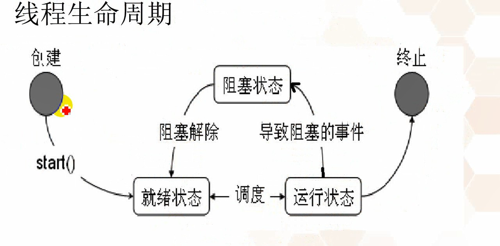
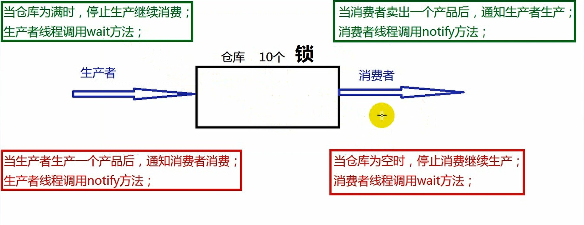

##11/29/2019 9:25:18 AM 
###We're in the fight of our lives.
>我们都在生命中奋斗着
###任务：基于Java多线程并发技术实现生产者和消费者案例模型（至少2种方法）
####1熟悉java线程应用技术
#####* 线程
  	  1. 基本概念
  	     程序 - 数据结构+算法，主要指存放在硬盘上的可执行文件。
		 进程 - 主要指运行在内存中的可执行文件。

		 目前主流的操作系统都支持多线程，是为了操作系统同时执行多个任务，但进程都是重量级的，新建进程对系统的资源消耗比较大，因此进程的数量比较局限
		 线程是进程内部的程序流，也就是说操作系统中支持多个进程，而每个进程的内部又可以支持多个线程，并且线程是轻量级的，新建线程会共享所有进程的系统资源，因此主流的开发都采用多线程。
		 多线程技术是采用时间片轮转法来保证线程的并发执行，所谓并发就是宏观并行微观串行的机制。
	  2. 线程的创建
	  	 1. 线程的创建方式
	  	 	java.lang.Thread类主要用于描述线程，Java虚拟机允许应用程序执行多个线程，而线程的创建和启动方式如下：
				a. 自定义类继承Thread类并重写run方法,然后创建该类的对象调用start方法；
				b. 自定义类实现Runnable接口并重写run方法，然后创建该类的对象作为实参来构造Thread类对象，最后使用Thread类的对象调用start方法；
		 2. 相关方法的解析
		 	Thread() - 使用无参方式构造对象
			Thread（String name)-根据参数指定的名称来构造对象
			Thread(Runnable target,String name)-根据参数指定的接口引用和名称构造对象

			void run()-若线程对象是采用Runnable对象构造的，调用run方法时最终调用Runnable接口引用所指向的run方法，否则调用该方法啥也不做。
			void start() - 用于启动线程，Java虚拟机会自动调用该线程的run方法。
		 3. 原理分析
		 	a.执行main方法的线程叫作主线程，执行run方法的线程叫作子线程；
			b.main方法是程序的入口，对于start方法调用之前的代码来说由主线程执行一次，当start方法调用成功后线程的个数由一个变成了两个，新创建的线程去执行run方法的代码，主线程继续向下执行，两个线程各自独立运行互不影响；
			c.当run方法执行完毕后则子线程结束，当main方法执行完毕后主线程结束，两个线程的先后执行次序没有明确的规定，由系统的调度算法决定；
		 4. 两种方式的比较
		 	a.使用继承Thread类的代码比较简单，但Java语言支持单继承，若该类继承了Thread类就无法继承其他类。
		 	b.使用实现Runnable接口的方式的代码比较复杂，但不影响该类继承其他类以及实现其他接口，在以后的开发中推荐该方式。
	  3. 线程的编号和名称
	  		long getId()	用于获取调用对象所表示线程的编号
			String getName()	用于获取调用对象所表示线程的名称
			void setName(String name)	用于设置线程的名称为参数指定的数值
			static Thread currentThread()	获取当前正在执行线程的引用
****
####11/29/2019 3:40:14 PM 
#####使用匿名内部类的方式创建线程
	* 匿名内部类的语法格式： 父类/接口类型 变量名 = new 父类/接口类型（）{重写}
		类写法一
			Thread t1 = new Thread(){
				@Override
				public void run(){
					System.out.println("拉拉");
				}
			};
			t1.start();
		类写法二
			new Thread(){
				@Override
				public void run(){
					System.out.println("junk print");
				}
			}.start();
	* 使用接口和匿名内部类的方式创建和启动线程
		接口写法一
			Runnable ra = new Runnable(){
				@Override
				public void run(){
					System.out.println(junk print);
				}
			}；
			Thread t2 = new Thread(ra);
			t2.start();
		接口写法二
			new Thread(new Runnable(){
				@Override
				public void run(){
					System.out.println("junk print");
				}
			}).start();
****
####Thread life_cycle

	
	新建状态 - 使用new关键字创建之后进入的状态
			- 此时线程并没有开始执行。
	
	就绪状态 - 调用start方法后进入的状态
			-此时线程还是没有开始执行
	
	运行状态 - 使用线程调度器调用该线程进入的状态。
			-此线程开始执行。
			-当线程的时间片执行完毕后任务没有完成时回到就绪状态。

	消亡状态 - 当线程的任务执行完成后进入的状态。
			-此时线程已经终止。
	
	阻塞状态 - 当线程执行的过程中发生了阻塞事件进入的状态，如sleep方法。
			-阻塞状态接触后进入就绪状态。
*****
###11/29/2019 7:34:50 PM 
####Thread的优先级(priority)使用
	Thread类的常用方法如下：
		int getPriority 用于获取线程的优先级
		void setPriority(int) 更改线程的优先级
		void join()	等待该线程的终止
		void join(long millis)	表示等待参数指定的毫秒数
		boolean isDaemon()	用于判断是否为守护线程
		void setDaemon(boolean on)	用于设置线程为守护线程
>>优先级越高的线程，获取时间片的机会越多，越有可能先执行完，但并不一定先执行。

######关于键盘输入以及写入文件
	BufferedReader br = new BufferedReader(new InputStreamReader(System.in));
	String msg = br.readLine();

	PrintStream ps = new PrintStream(new FileOutputStream("c:/a.txt"));
	ps.println(msg);
####Thread的停止
	可以使用Thread.stop(); //已过时，不推荐使用
	可以通过价格boolean 的标志位，来停止线程
	待续。。。

####Thread类的常用方法：
	static void yield()		当前线程让出处理器（离开Running状态），使当前线程进入Runnable状态等待。

	static void sleep(times)	使当前线程从Running放弃处理器进入Block状态，休眠times毫秒，再返回到Runnable如果其他线程打断当前线程的Block（sleep),就会发生InterruptedException	
	void join()		等待该线程终止（当前执行的线程等待调用对象所描述的线程终止）
	void join(long millis)		等待参数指定的毫秒数
	boolean isDaemon()		用于判断是否为守护线程
	void setDaemon(boolean on)		用于设置线程为守护线程(jav程序中所有非守护线程结束后，守护线程会随之结束)
****
###11/30/2019 4:31:19 PM 
####线程的同步机制
	1. 基本概念
	   当多个线程同时访问同一种共享资源时，可能会造成数据的覆盖等不一致性的问题，此时就需要对多个线程之间进行通信和协调，该机制就叫做线程的同步机制。
	2. 如何解决线程安全问题，需将异步操作改为同步操作。
	   异步操作：多线程并发的操作，各自独立运行。
	   同步操作：多线程串行的操作，先后执行的顺序。
	
####线程同步的实现
	Java提供了一种内置的锁机制来支持原子性，使用synchronized关键字。
	第一种实现方式如下：
		使用同步代码块的方式实现部分代码的锁定，格式如下：
			synchronized（类类型的引用）{
				编写所有需要锁定得代码；
			}
			类类型引用不可使用 new Demo();这相当于多把锁

	第二种实现方式如下：
		使用同步方法的方式来实现所有代码的锁定。
			直接使用synchronized关键字来修饰整个方法即可
			例如：public synchronized void Demo(){}
			该方式等价于（等价就是能锁住都锁住，不能则都不能）：
				syncnronized(this){整个方法体的代码} 
				在成员方法中出现this关键字表示当前正在调用的对象，调用run方法的调用对象是传入的引用变量，由于两个线程用的是同一个引用变量，因此可以实现线程的同步。

	第三种实现方式如下：
		<T> Future<T> 
 			submit(Callable<T> task) 
          提交一个返回值的任务用于执行，返回一个表示任务的未决结果的 Future。 
		  Callable<T> 接口主要用于线程池
		
*****

####死锁的概念
	线程一执行的代码：
		public void run(){
			synchronized(a){	//持有对象锁a等待对象锁b
				synchronized(b){
					...
				}
			}
		}

	线程二执行的代码：
		public void run(){
			sychronized(b){		//持有对象锁b等待对象锁a
				syncnronized(a){
					...
				}
			{
		}

	
	当两个线程或多个线程之间互相锁定时，就形成了死锁。
	避免死锁的原则
		顺序上锁，反向解锁，不要回头

	注意：在以后的开发中尽量不要使用同步代码块的嵌套结构，来避免死锁的发生。

####Object类中常用的方法
	void wait() - 用于使得线程进入等待状态，直到其他线程调用notify()或notifyAll()方法
	void wait(long timeout) - 用于进入等待状态，直到其他线程调用方法或参数指定的毫秒数已经过去为止
	void notify() - 用于唤醒等待的单个线程
	void notifyAll() - 用于唤醒等待的所有线程
	调用wait和notify方法需要注意的细节:
		wait方法与notify方法必须要由同一个锁对象调用。因为：对应的锁对象可以通过notify唤醒使用同一个锁对象调用的wait方法后的线程。
		wait方法与notify方法是属于Object类的方法的。因为：锁对象可以是任意对象，而任意对象的所属类都是继承了Object类的。
		wait方法与notify方法必须要在同步代码块或者是同步函数中使用。因为：必须要通过锁对象调用这2个方法。
####[生产者消费模型](https://www.cnblogs.com/xiaowenboke/p/10469125.html)

###12/1/2019 10:40:59 PM 
####其他的锁
	Lock lock = new ReentrantLock()
	ReentrantLock	一个可重入的互斥锁 Lock，它具有与使用 synchronized 方法和语句所访问的隐式监视器锁相同的一些基本行为和语义，但功能更强大。
	
	方法：
		 void lock() 
	          获取锁。 
		 void unlock() 
	          试图释放此锁。 
		 Condition newCondition() 
	          返回用来与此 Lock 实例一起使用的 Condition 实例。 

	Condition condition = lock.newCondition();
####接口 Condition
	Condition 将 Object 监视器方法（wait、notify 和 notifyAll）分解成截然不同的对象，以便通过将这些对象与任意 Lock 实现组合使用，为每个对象提供多个等待 set（wait-set）。其中，Lock 替代了 synchronized 方法和语句的使用，Condition 替代了 Object 监视器方法的使用。 
	
	方法：
		 void await() 
          造成当前线程在接到信号或被中断之前一直处于等待状态。 
		 void signal() 
          唤醒一个等待线程。 
		 void signalAll() 
          唤醒所有等待线程。 

###12/2/2019 3:01:23 PM 
####线程池
	线程池的技术原理
		在服务器编程模型的原理，每一个客户端链接一个单独的线程为之服务，当与客户端的会话结束时，线程也就结束了，即每来一个客户端链接，服务器端就要创建一个新线程。
		如果访问服务器的客户端很多，那么服务器要不断地创建和销毁线程，这将严重影响服务器的性能。
		线程池的概念：首先创建一些线程，它们的集合成为线程池，当服务器接收到一个客户请求后，就从线程池中取出一个空闲的线程为之服务，服务完后不关闭该线程，而是将该线程还回到线程池中。
		在线程池的编程模式下，任务是提交给整个线程池，而不是直接交给某个线程，线程池在拿到任务后，他就在内部找有无空闲的线程，再把任务交给内部某个空闲的线程。
		任务是提交给整个线程池。
		一个线程同时只能执行一个任务，但可以同时向一个线程池提交多个任务
	方法：

		类 Executors：
		static ExecutorService newFixedThreadPool(int nThreads) 
          创建一个可重用固定线程数的线程池，以共享的无界队列方式来运行这些线程。 

		接口 ExecutorService：
		void shutdown() 
          启动一次顺序关闭，执行以前提交的任务，但不接受新任务。 
 				List<Runnable> shutdownNow() 
          试图停止所有正在执行的活动任务，暂停处理正在等待的任务，并返回等待执行的任务列表。 
			<T> Future<T> 
 				submit(Callable<T> task) 
          提交一个返回值的任务用于执行，返回一个表示任务的未决结果的 Future。 
 				Future<?> submit(Runnable task) 
          提交一个 Runnable 任务用于执行，并返回一个表示该任务的 Future。 
			<T> Future<T> 
 			submit(Runnable task, T result) 
          提交一个 Runnable 任务用于执行，并返回一个表示该任务的 Future。 

	

