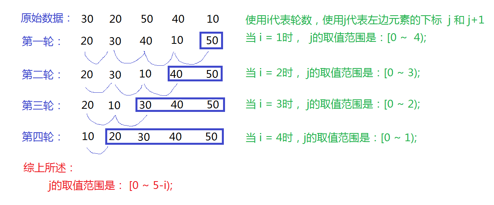

##11/25/2019 7:49:11 PM 
##Above all, don't lose hope.
<b>最重要的是，别放弃希望。</b>
#任务： 冒泡排序和快速排序
###11/25/2019 10:04:53 AM 
####冒泡排序

1. 第一层循环代表循环的轮数，n-1次循环即可
2. 第二层循环代表的是比较的次数，从下标0开始比较，< n-1
3. 优化，如果输入一串顺序的数字可以直接输出，通过flag位实现
*********
	package com.wltbk.sort;

	import java.util.ArrayList;
	import java.util.List;
	import java.util.Scanner;
	import java.util.Stack;
	
	public class BubbleSort {
    //开启键盘扫描器
    private static Scanner scanner = new Scanner(System.in);
    //声明一个集合
    private static List<Integer> lt = new ArrayList<>();
    //声明一个堆栈
    private static Stack<Integer> ltt = new Stack<>();

    /**
     * 冒泡排序算法
     * @param lt 是一个排序前的集合
     * @return 是一个排序之前的集合
     */
    public static List<Integer> mubbleSortOperator(List<Integer> lt){
        int num = lt.size();
        for(int i = 1;i<num;i++){
            boolean flag = true;
            for(int j = 0;j<num-i;j++){
                if(lt.get(j)>lt.get(j+1)) {
                    int temp = lt.get(j+1);
                    lt.set(j+1,lt.get(j));
                    lt.set(j,temp);
                    flag = false;
                }
            }
            if(flag){
                break;
            }
        }
        return lt;
    }

    public static void main(String[] args) {
        System.out.println("请添加数字： -1退出");
        while(true){
            int num = scanner.nextInt();
            if(num == -1){
                break;
            }
            lt.add(num);
        }
        System.out.println("未排序的值： ");
        for (int i=0;i<lt.size();i++){
            int num = lt.get(i);
            System.out.print(num+" ");
        }
        System.out.println();

        List<Integer> lt1 = mubbleSortOperator(lt);

        System.out.println("排序之后的值：");
        for (int i=0;i<lt1.size();i++){
            int num = lt1.get(i);
            System.out.print(num+" ");
        }

        for (int i=0;i<lt1.size();i++){
            int num = lt1.get(i);
            ltt.push(num);
        }
        System.out.println("\n倒序之后的值：");
        for(int i = 0;i<lt.size();i++){
            System.out.print(ltt.peek()+" ");
            ltt.pop();
        }
        //关闭键盘扫描
        scanner.close();
    }

	}
******
###11/25/2019 2:57:22 PM 
####快速排序
1. 选择样本数列中的中间元素作为基准值并单独保存；
2. 分别使用左右两边的元素依次与基准值进行比较，将所有比基准值小的放左边，将所有大于等于基准值的元素放在右边，这个过程叫作分组；
3. 直到左右两边的元素下标重合时，将基准值放到重合的位置；
4. 分别对左右两边的分组进行再次分组，使用递归的思想。

######第一种快速排序的方式
* Arrays.sort(数组名)；
* System.out.println(Arrays.toString(数组名));
######第二种快速排序的方式
***
	package cn.itxdl.day28;
	
	import java.util.Arrays;
	
	public class TestSort {
	
	//自定义成员方法实现快速排序算法
	public static void quick(int[] arr, int left, int right){
		//1.计算中间元素的下标并使用变量记录
		int p = (left+right) / 2;
		//2.选择中间元素作为基准值并单独保存起来
		int pivot = arr[p];
		//3.分别使用左右两边的元素依次与基准值比较大小，将所有小于基准值的元素放在左边，
		//  将所有大于等于基准值的元素放在基准值的右边
		//给左右两边的元素下标指定替身，为了递归方便
		int i = left;
		int j = right;
		for( ; i < j; ){
			//若左边有元素并且左边的元素小于基准值，则使用下一个元素与基准值比较
			while(i < p && arr[i] < pivot){
				i++;
			}
			//直到左边有元素但左边的元素不再小于基准值时，则将左边的元素赋值给p指向的
			//位置，p指向该元素原来的位置
			if(i < p){
				arr[p] = arr[i];
				p = i;
			}
			//若右边有元素并且右边的元素大于等于基准值，则使用下一个元素与基准值比较
			while(p < j && arr[j] >= pivot){
				j--;
			}
			//直到右边有元素但右边的元素不再大于等于基准值时，则将右边的元素赋值到p指向
			//的位置，p指向该元素原来的位置
			if(p < j){
				arr[p] = arr[j];
				p = j;
			}
		}
		//4.直到左右两边的元素下标重合时，将基准值放到重合的位置
		arr[p] = pivot;
		//5.分别对左右两边的分组进行再次分组，使用递归的思想
		//左右两边的分组分别至少有2个元素才需要递归
		if(p - left > 1){
			quick(arr, left, p-1);
		}
		if(right - p > 1){
			quick(arr, p+1, right);
		}
	}
	
	public static void main(String[] args) {
		
		int[] arr = {20, 8, 25, 3, 15, 20, 12, 18, 10};
		//调用排序算法进行排序
		//TestSort.bubble(arr);
		TestSort.quick(arr, 0, arr.length-1);
		//Arrays.sort(arr); 
		//打印排序后的结果
		System.out.print("排序后的结果是：");
		for(int i : arr){
			System.out.print(i + " ");
		}
		System.out.println();
	}

	}
***
