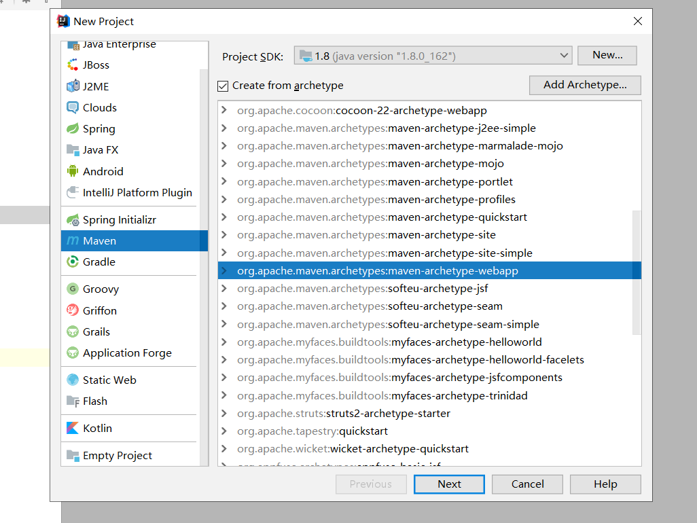
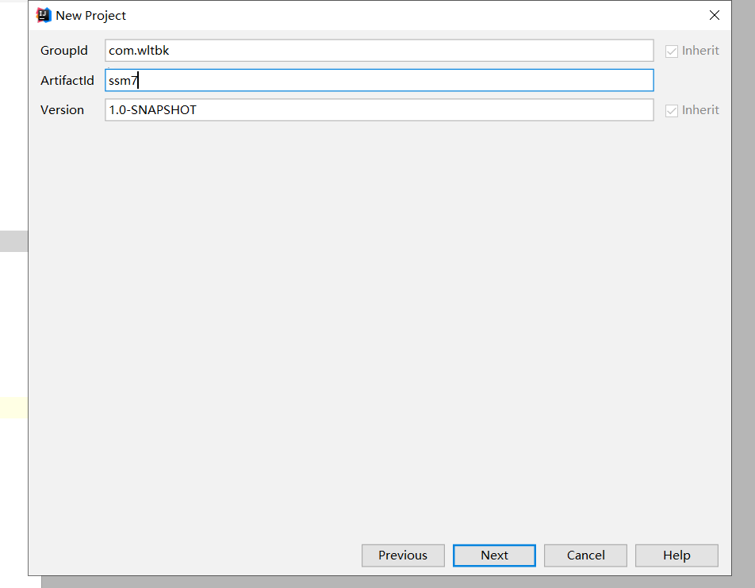
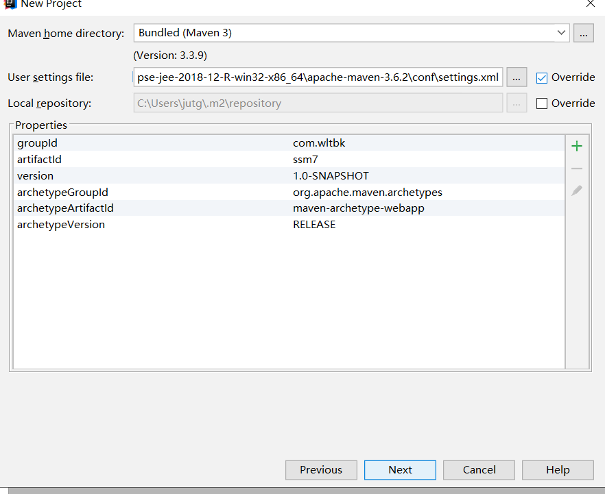
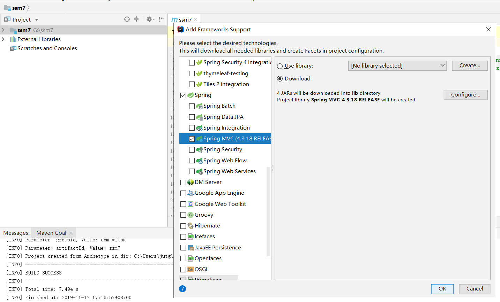

##任务要求 安装一个idea工具，使用工具开发一个Maven项目，上传到GitUP仓库
###idea的安装与破解
####1. 安装
	下一个idea
####2. 破解
1. 首先下载一个jar包 
[JetbrainsCrack-2.10-release-enc.jar](http://www.wltbk.com/An/JetbrainsCrack-2.10-release-enc.jar)  
2. 将这个jar包放在你所安装的idea的bin目录里面 
3. 配置 idea.exe.vmoptions 和 idea64.exe.vmoptions  
   * 即在它们最后一行添加下载的jar包所安放的位置
   * -javaagent:F:\IntelliJ IDEA 2018.1.5\bin\JetbrainsCrack-2.10-release-enc.jar
4. 最后在idea安装是粘贴json格式字符串  

	ThisCrackLicenseId-{
	"licenseId":"ThisCrackLicenseId",
	"licenseeName":"Rover12421",
	"assigneeName":"",
	"assigneeEmail":"rover12421@163.com",
	"licenseRestriction":"For Rover12421 Crack, Only Test! Please support genuine!!!",
	"checkConcurrentUse":false,
	"products":[
	{"code":"II","paidUpTo":"2099-12-31"},
	{"code":"DM","paidUpTo":"2099-12-31"},
	{"code":"AC","paidUpTo":"2099-12-31"},
	{"code":"RS0","paidUpTo":"2099-12-31"},
	{"code":"WS","paidUpTo":"2099-12-31"},
	{"code":"DPN","paidUpTo":"2099-12-31"},
	{"code":"RC","paidUpTo":"2099-12-31"},
	{"code":"PS","paidUpTo":"2099-12-31"},
	{"code":"DC","paidUpTo":"2099-12-31"},
	{"code":"RM","paidUpTo":"2099-12-31"},
	{"code":"CL","paidUpTo":"2099-12-31"},
	{"code":"PC","paidUpTo":"2099-12-31"}
	],
	"hash":"2911276/0",
	"gracePeriodDays":7,
	"autoProlongated":false}
###idea的设置
####1. [idea jdk](https://blog.csdn.net/qq_28289405/article/details/82698856)
####2. [idea tomcat](https://blog.csdn.net/wsjzzcbq/article/details/89463304)
####3. [idea maven](https://www.jianshu.com/p/467bd544998d)
####4. [idea git](https://jingyan.baidu.com/article/9080802232da03fd91c80fdd.html)

###idea创建maven项目webssm
####创建一个maven项目

####创建一个mvc

1. 创建完后，项目里有一个lib的jar包文件夹，我们是通过pom.xml进行配置jar包的，不需要这个lib包，所以可以将它删掉。
2. 在pom.xml中配置所需ssm的jar包。
3. 配置项目所需的各种包（resources java test ....）
4. 授予包所对应的的权限
5. 配置webxml 需要在servlet里加一个参数   
		<init-param>    
            <param-name>contextConfigLocation</param-name>  
            <param-value>/WEB-INF/dispatcher-servlet.xml</param-value>  
        </init-param>
6. 配置 dispatcher-servlet.xml
<button onclick="window.location='./txt/web.txt'">点击跳转</button>
7. 配置 applicationContext.xml       
	<context:component-scan base-package="java">  
 	</context:component-scan>
8. 编写controller
9. 编写jsp
10. dispatcher-servlet.xml 再配置 viewResolver
11. 至此，mvc创建完毕
