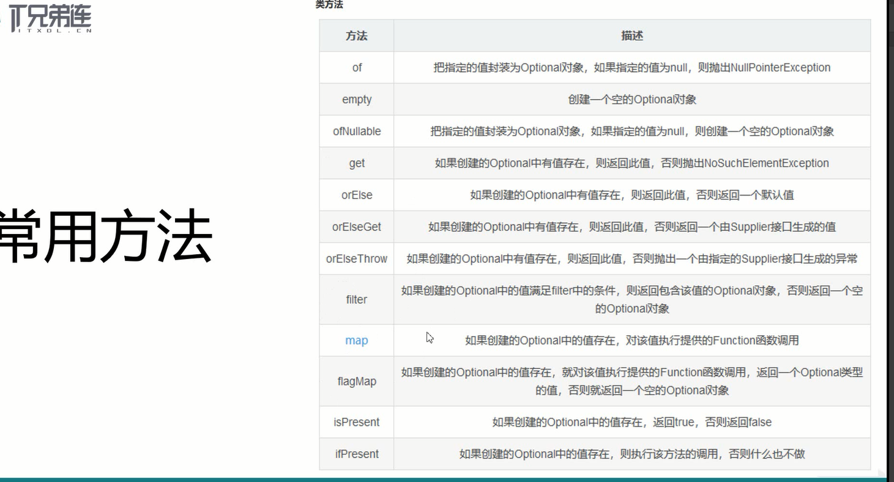

##12/29/2019 9:39:05 PM 
###You'll shine.
**你会发光的。**
###
Optional

####Optional类
	Optional被定义为一个简单的容器（值可以为null的容器对象），其值可能是null或者不是null,代表一个值存在或不存在。
	Optional提供了很多有用的方法，这样我们就不用显式的进行空值检测
	Optional类引入了很好的解决空指针异常

