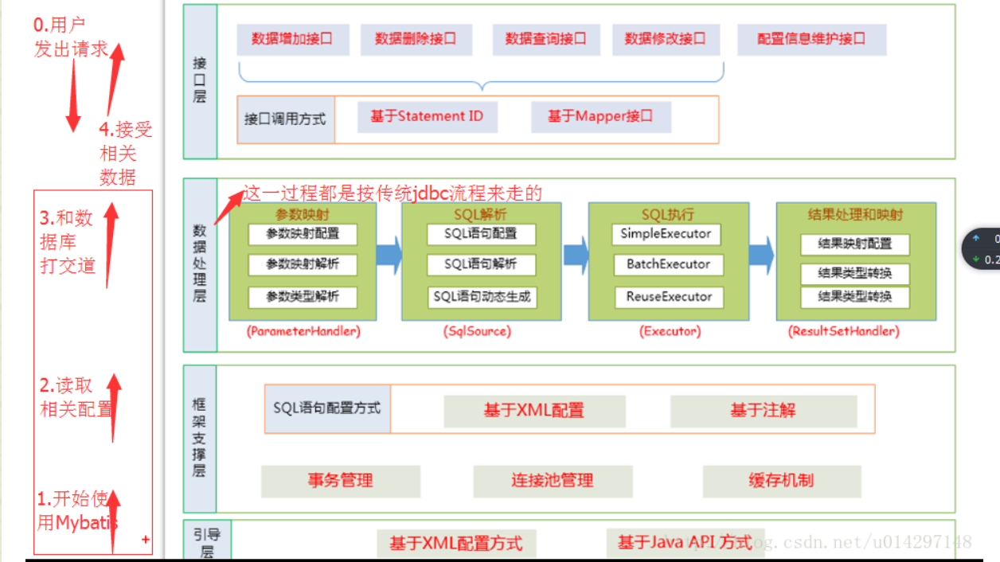
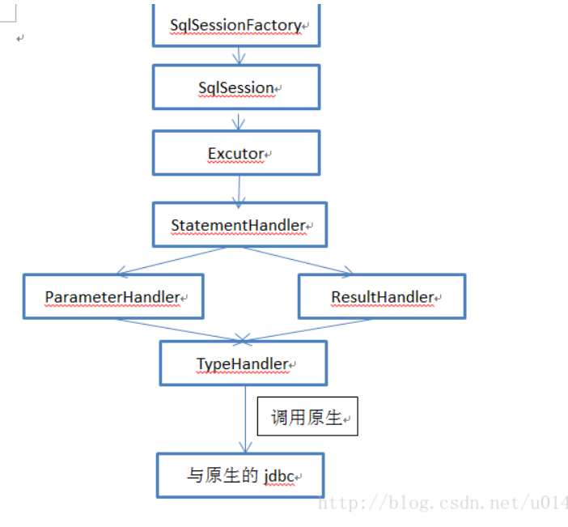
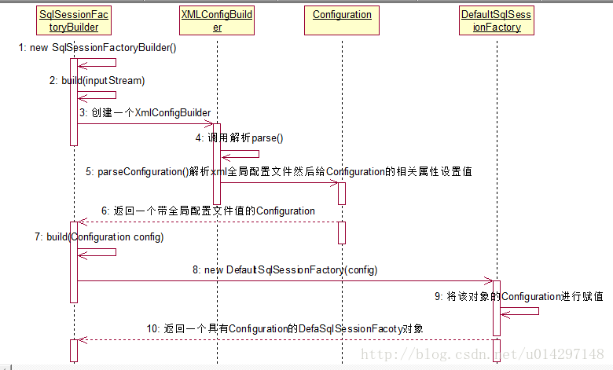
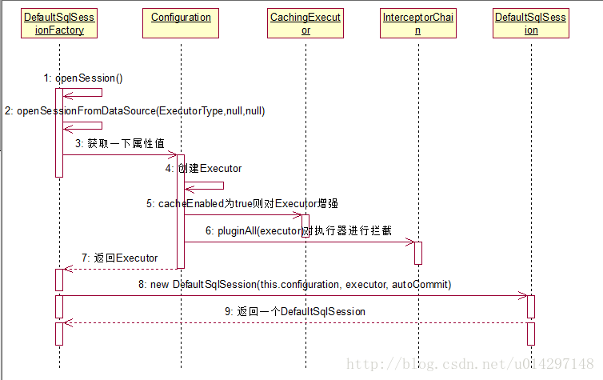
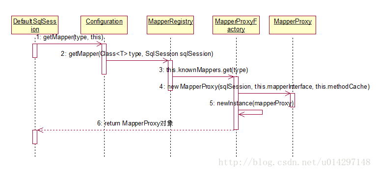
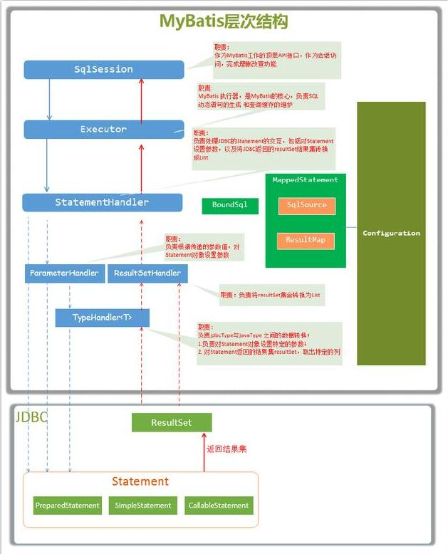

###12/11/2019 9:34:35 PM 
###Happy indeed we are without hate among the hateful.

**在充满愤怒的人群中不怀丝毫的恨意，生活才能够快乐。**

##任务：使用JDBC技术动态获取表结构,并将查询结果动态映射成实体对象（模拟MyBatis框架部分功能）
###1. 了解JDBC元数据概念、API及作用
	元数据：在jdbc中可以使用元数据获取数据库、表、表中字段等一些信息
	元数据的作用：在jdbc中可以获取元数据的信息，通过元数据可以编写一些通用性较高的代码、框架
	元数据的分类：数据库元数据（DataBaseMetaData）、参数元数据(ParameterMetaData)、结果集元数据(ResultSetMetaData)

####1.1 DataBaseMetaData 数据库元数据
	获取数据库元数据：DataBaseMetaData dbmd = Connection.getMetaData()
	DataBaseMetaData对象：
		获取数据库的链接的基本信息
		getURL()	:	返回一个String类对象，代表数据库的URL
		getUserName()	:	返回链接当前数据库管理系统的用户名
		getDriverName()		：	获取驱动驱动程序的名称

		获取表的基本信息
		ResultSet res = dbmd.getPrimaryKeys(String catalog,String schema,String table)
		- 返回指定主键的结果集

####1.2 ParameterMetaData 参数元数据

	作用：
		可以获取SQL语句中？号的个数、类型等。
		-获得参数元数据： PreparedStatement.getParameterMetaData()
		-获得参数的个数
		getParameterCount()
		-获得指定参数的sql类型
		getParameterTypeName(int param)
		-异常处理
		getParameterType

		-MySQL中默认不让获取参数的类型，所有需要在URL后面添加该参数
		Parameter metadata not available for the given statement
		?generateSimpleParameterMetadata=true
		-使用参数元数据类型不正确，这是因为MySQL支持的不好。想要获取正确的参数数据类型，需要使用结果集元数据

####1.3 ResultSetMetaData 元数据
	作用：获取结果集中列的相关信息
	--获得结果集
		ResultSet res = dbmd.getPrimaryKeys(String catalog,String schema,String table)
	--获得ResultSetMetaData对象
		ResultSet.getMetaData();

	--返回resultset对象的列数
		getColumnCount() 返回resultset对象的列数
		getColumnName(int column) 获得指定列的名称
		getColumnType(int column) 获得指定列的类型
###12/13/2019 4:09:59 PM 
#### [mybatis的框架运行原理](https://blog.csdn.net/u014297148/article/details/78696096)
**mybatis框架分层**

	mybatis实现原理
		mybatis底层是采用原生jdbc对数据库进行操作的，只是通过SqlSessionFactory,SqlSession Executor,StatementHandler,ParameterHandler,ResultHandler和TypeHandler等几个处理器封装了这些过程
			执行器：Excutor(update,query,flushStatements,commit,getTransaction,close,isClosed)
			参数处理器：ParameterHandler(getParameterObject,setParameters)
			结构处理器ResultSetHandler(handleResultSets,handleOutputParameters)
			sql查询处理器：StatementHandler(prepare,parameterize,batch,update,query)

		其中StatementHandler通过用ParameterHandler与ResultHandler分别进行参数预编译和结果处理。而ParameterHandler与ResultHandler都使用TypeHandler进行映射。如下图：

####mybatis解决的问题
	1. 使用数据库连接池管理连接，避免了频繁创建了，关闭连接，浪费资源，影响性能的问题。
	2. 用xml管理sql语句，让Java代码和sql语句分离，使得代码更易维护
	3. 解决了sql语句参数不定。xml中可以通过为where条件决定SQL语句的条件参数。mybatis将Java对象映射到SQL语句，通过statement的parameterType定义输入参数的类型。
	4. mybatis自动将结果集封装成Java对象，通过statement的resultType定义输出的类型。避免了因SQL变化，对结果集处理麻烦的的问题。

####Mybatis的工作过程
	创建SqlSessionFactory的过程，sqlSessionFactory是DefaultSessionFactory类型的，但是configuration此时被初始化了。以下是创建DefaultSessionFactory的时序图。

	创建SqlSession的过程
	SqlSessionFactory.openSession()返回的SqlSession是DefaultSqlSession类型，此SqlSession里包含一个Configuration的对象，和一个Executor对象。查看源码后画如下创建DefaultSession的时序图：

	创建mapper的过程，mapper是一个Mapper代理对象，而且初始化了Configuration对象，Executor的对象。查看源码后画如下创建Mapper的时序图： 

	运行时涉及到的类
		1. Resources Mybatis中的Io流的工具类
		-- 加载配置文件
		2. SqlSessionFactoryBuilder()构建器
		-- 创建SqlSessionFactory接口的实现类
		3. XMlConfigBuilder MyBatis全局配置文件内容构建器
		-- 作用负责读取流内容并转换为java代码
		4. Configuration 封装了全局配置文件的所有配置信息
		-- 全局配置文件内容存放在Configuration中
		5. DefaultSqlSessionFactory是SqlSessionfactory接口的实现
		6. Transaction 事务类
		-- 每一个SqlSession会带有一个Transaction对象
		7. TransactionFactory 事务工厂
		-- 负责生产Transaction
		8. Executor mybatis执行器
		-- 作用：负责执行失去了命令  
		-- 相当于jdbc中statement对象（或PreparedStatement或CallableStatement）
		-- 默认的执行器 SimpleExecutor
		-- 批量操作 BatchExecutor
		-- 通过openSession(参数控制)
		9. DefaultSqlSession是SqlSession接口的实现类
		10. ExceptionFactory MyBatis中的异常工厂

####[文字解释](https://www.bilibili.com/video/av34489303?p=35)

	在Mybatis运行时开始需要通过Resources加载全局配置文件。
	下面需要实例化SqlSessionFactoryBuilder构建器。帮助SqlSessionFactory接口实现类DefaultSqlSessionFactory。
	在实例化DefaultSqlSessionFactory之前需要先创建XmlConfigBuilder解析全局配置文件流，并把解析结构存放在Configuration中。
	之后把Configuration传递给DefaultSqlSessionFactory，到此SqlSessionFactory工厂创建成功。  
	由SqlSessionFactory工厂创建SqlSession.同时还需要创建SqlSession的执行器Excutor,最后实例化DefaultSession,传递给SqlSession接口。
	最后调用getMapper方法，通过实现JDK动态代理得到一个MapperProxy代理对象，调用MapperMethod类的execute方法，
	通过StatementHandler,ResultHandler对象执行SQL语句，得到一个结果集的集合，将之返回。

	Mybatis的执行原理

><T> T getMapper(Class<T> var1);	