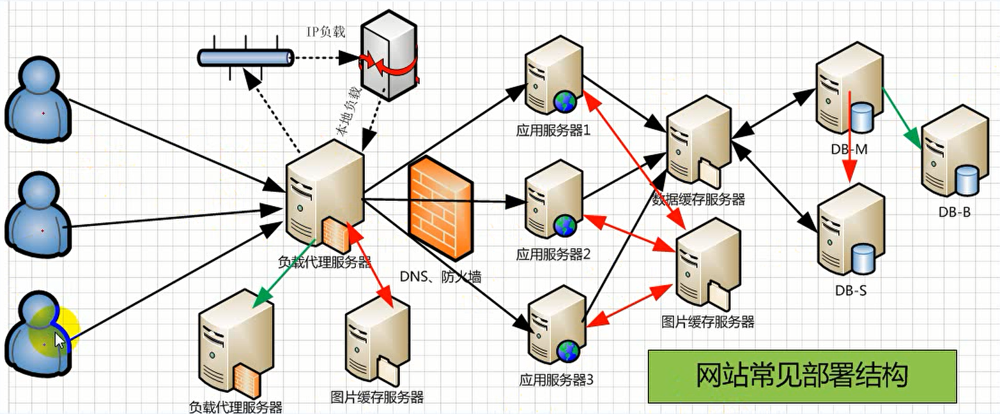

##1/10/2020 7:53:12 PM 
##Life is never static.
**人生充满变数。**
##搭建MySql数据库集群环境
####
常见网站部署

	ip负载：ip负载均衡技术是在负载调度器的实现技术中最高效的，在已有的ip负载均衡技术中主要有通过网络地址转换，将一组服务器构建成一个高性能的、高可用的虚拟服务器，我们称之为VS/NAT技术。

	mysql主从复制
		一主一从
		主主复制
		一主多从 --扩展系统读取的性能，因为读是在库读取的；
		多主一从 --5.7开始支持
		联级复制

####用途及条件
	mysql主从复制用途
		实时灾备，用于故障处理
		读写分离，提供查询服务
		备份，避免影响业务（备可用性和容错行）
		负载平衡
	主从部署必要条件
		主库开启binlog日志（设置log-bin参数）
		主从server-id不同
		从库服务器能连通主库
####主从原理

