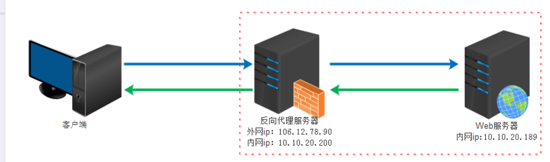
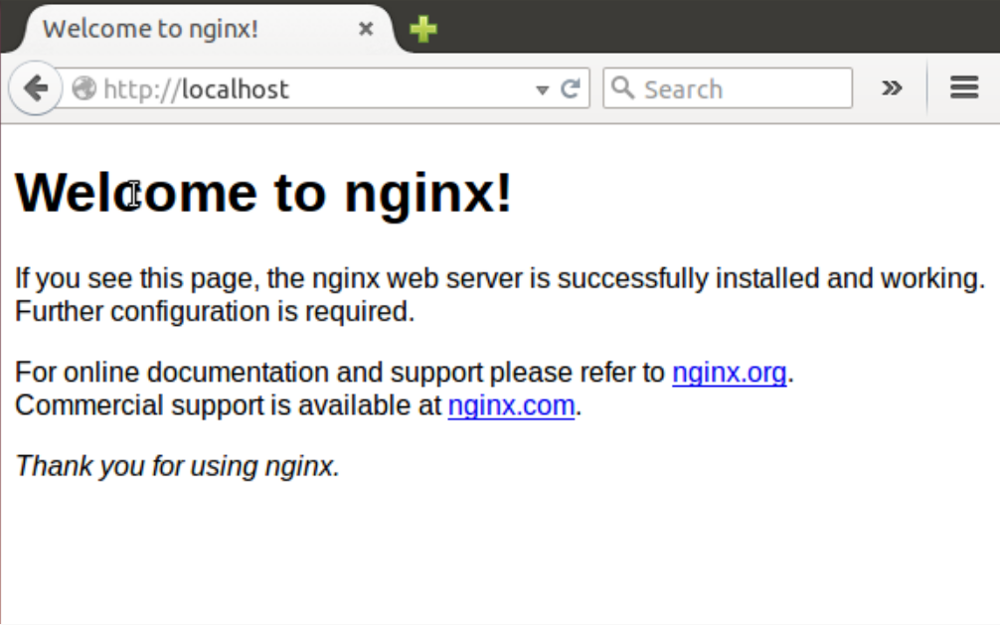
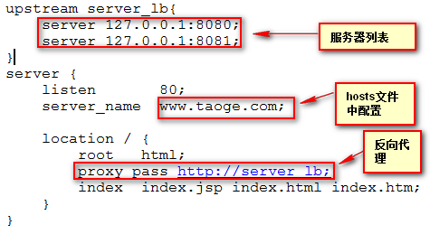
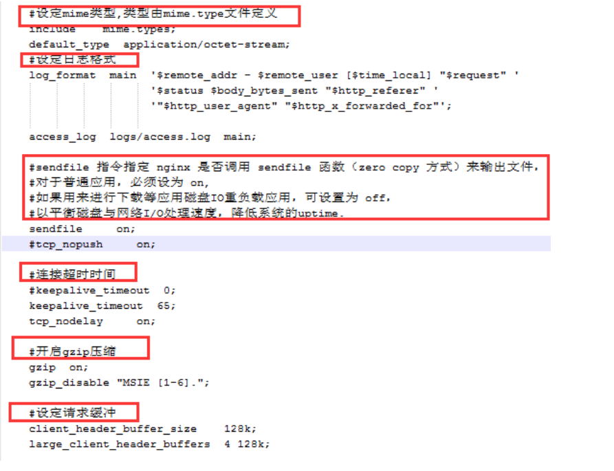

##1/4/2020 8:58:58 AM 
##Love is putting someone else’s needs before yours.
**爱就是把某个人看得比你自己重要。**
###
任务：能够使用Nginx搭建Tomcat集群,并完成负载均衡.

####Nginx基本概念
	定义：
		Nginx (engine x) 是一个高性能的HTTP和反向代理web服务器，同时也提供了IMAP/POP3/SMTP服务。

>[配置tomcat](https://blog.csdn.net/xiaojingfirst/article/details/82817297)

####nginx的优点
	1. 更快
    这表现在两个方面：在高峰期（如有数以万计的并发请求），Nginx可以比其他Web服务器更快地响应请求。
	2. 高扩展性，跨平台
    Nginx的设计极具扩展性，它完全是由多个不同功能、不同层次、不同类型且耦合度极低的模块组成。因此，当对某一个模块修复Bug或进行升级时，可以专注于模块自身，无须在意其他。而且在HTTP模块中，还设计了HTTP过滤器模块：一个正常的HTTP模块在处理完请求后，会有一串HTTP过滤器模块对请求的结果进行再处理。这样，当我们开发一个新的HTTP模块时，不但可以使用诸如HTTP核心模块、events模块、log模块等不同层次或者不同类型的模块，还可以原封不动地复用大量已有的HTTP过滤器模块。这种低耦合度的优秀设计，造就了Nginx庞大的第三方模块，当然，公开的第三方模块也如官方发布的模块一样容易使用。
    Nginx的模块都是嵌入到二进制文件中执行的，无论官方发布的模块还是第三方模块都是如此。这使得第三方模块一样具备极其优秀的性能，充分利用Nginx的高并发特性，因此，许多高流量的网站都倾向于开发符合自己业务特性的定制模块。
	3. 高可靠性：用于反向代理，宕机的概率微乎其微
    高可靠性是我们选择Nginx的最基本条件，因为Nginx的可靠性是大家有目共睹的，很多家高流量网站都在核心服务器上大规模使用Nginx。Nginx的高可靠性来自于其核心框架代码的优秀设计、模块设计的简单性；另外，官方提供的常用模块都非常稳定，每个worker进程相对独立，master进程在1个worker进程出错时可以快速“拉起”新的worker子进程提供服务。

	4. 低内存消耗
    一般情况下，10 000个非活跃的HTTP Keep-Alive连接在Nginx中仅消耗2.5MB的内存，这是Nginx支持高并发连接的基础。
	5. 单机支持10万以上的并发连接
    这是一个非常重要的特性！随着互联网的迅猛发展和互联网用户数量的成倍增长，各大公司、网站都需要应付海量并发请求，一个能够在峰值期顶住10万以上并发请求的Server，无疑会得到大家的青睐。理论上，Nginx支持的并发连接上限取决于内存，10万远未封顶。当然，能够及时地处理更多的并发请求，是与业务特点紧密相关的。
	6. 热部署
     master管理进程与worker工作进程的分离设计，使得Nginx能够提供热部署功能，即可以在7×24小时不间断服务的前提下，升级Nginx的可执行文件。当然，它也支持不停止服务就更新配置项、更换日志文件等功能。
	7. 最自由的BSD许可协议
    这是Nginx可以快速发展的强大动力。BSD许可协议不只是允许用户免费使用Nginx，它还允许用户在自己的项目中直接使用或修改Nginx源码，然后发布。这吸引了无数开发者继续为Nginx贡献自己的智慧。
    以上7个特点当然不是Nginx的全部，拥有无数个官方功能模块、第三方功能模块使得Nginx能够满足绝大部分应用场景，这些功能模块间可以叠加以实现更加强大、复杂的功能，有些模块还支持Nginx与Perl、Lua等脚本语言集成工作，大大提高了开发效率。这些特点促使用户在寻找一个Web服务器时更多考虑Nginx。
    选择Nginx的核心理由还是它能在支持高并发请求的同时保持高效的服务。
####什么是负载均衡
	负载均衡（Load Balance）就是一个web服务器解决不了的问题可以通过多个web服务器来平均分担压力来解决，并发过来的请求被平均分配到多个后台web服务器来处理，这样压力就被分解开来。
####负载均衡服务器分类
	负载均衡服务器分为两种一种是通过硬件实现的负载均衡服务器，简称硬负载例如：f5。另一种是通过软件来实现的负载均衡，简称软负载:例如apache和nginx。硬负载和软负载相比前者作用的网络层次比较多可以作用到socket接口的数据链路层对发出的请求进行分组转发但是价格成本比较贵，而软负载作用的层次在http协议层之上可以对http请求进行分组转发并且因为是开源的所以几乎是0成本，并且阿里巴巴，京东等电商网站使用的都是Nginx服务器。
####什么是代理
	代理其实就是一个中介，A和B本来可以直连，中间插入一个C，C就是中介。
		透明代理 透明代理的意思是客户端根本不需要知道有代理服务器的存在，它改变你的request fields（报文），并会传送真实IP，多用于路由器的NAT转发中。 
		正向代理即是客户端代理, 代理客户端, 服务端不知道实际发起请求的客户端.

		反向代理即是服务端代理, 代理服务端, 客户端不知道实际提供服务的服务端

####正向代理和反向代理的区别
	正向代理代理的对象是客户端，反向代理代理的对象是服务端

	正向代理：正向代理用途是为了在防火墙内的局域网提供访问internet的途径。另外还可以使用缓冲特性减少网络使用率
	反向代理：反向代理的用途是将防火墙后面的服务器提供给internet用户访问。同时还可以完成诸如负载均衡等功能
####代理的例子
	正向代理的至少一个功能（俗称翻墙）
	反向代理的至少一个功能（比如负载均衡）
####配置tomcat集群
	1 下载Tomcat
		http://tomcat.apache.org/download-70.cgi
	2 安装和配置tomcat
		解压并重命名，配置server.xml文件（即将端口号改成不同的）
		tomcat1  server.xml
			<server port="8005" shutdown="SHUTDOWN">
				<Connector port="8080" protocol="HTTP/1.1" connectionTimeout="20000" redirectPort="8443" />
				<Connector prot="8009" protocol="AJP/1.3" redirectPort="8443" />
				<Engine name="Catalina" defaultHost="localhost" jvmRoute="tomcat1">

		tomcat2 server.xml
			<server port="8006" shutdown="SHUTDOWN">
				<Connector port="8081" protocol="HTTP/1.1" connectionTimeout="20000" redirectPort="8443" />
				<Connector prot="8010" protocol="AJP/1.3" redirectPort="8443" />
				<Engine name="Catalina" defaultHost="localhost" jvmRoute="tomcat2">

####Nginx的安装
	1 解压并运行
		双击 nginx.exe,打开浏览器访问http://localhost显示如下界面

	相关命令
		nginx -s stop	关闭nginx
		nginx -s reload 重新加载nginx
		nginx -s start  启动

####Nginx负载均衡的配置
	1. 打开conf/nginx.conf这个文件

		通过以上的配置我们已经可以通过访问www.taoge.com访问到不同的tomcat来分担服务器端的压力.请求负载过程中会话信息不能丢失.那么需要在多个tomcat中session需要共享

	2. 

	三种解决方案
		第一种是以负载均衡服务器本身提供的session共享策略，每种服务期的配置是不一样的并且nginx本身是没有的。

		第二种是利用web容器本身的session共享策略来配置共享。针对于weblogic这种方式还是靠普的。但是针对于tomcat这种方式存在很大的缺陷，主要因为是依靠广播方式来实现的session复制，会浪费很多带宽导致整个网络反映缓慢。官网也建议这种方式最好不要超过4台tomcat,具体的内容可参考/webapps/docs/cluster-howto.html里面有详细的说明。下面是具体的配置过程
		第三种是Tomcat集群+redis的Session共享配置方法.
		在这里我们以第二种方式为例:
>[redis+Tomcat集群的Session共享配置](https://www.cnblogs.com/xiongze520/p/10333233.html)

####[负载均衡算法](https://blog.csdn.net/qq_37043780/article/details/82714830)
	1. 简单轮询
		顾名思义，这个方法是对后端web服务器进行简单的轮询，将请求按顺序发给后端服务器。
	2. 随机算法
		顾名思义，该算法就是每来一个请求，从后端服务器中随机地选择一个服务器处理请求
	3. 源地址哈希法
		该方法是对客户端的IP地址做一个Hash，然后对服务器列表的大小取模，得到处理该请求的服务器
	4. 加权轮询法
		该方法是在轮询的基础上加一个权重，权重高的服务器处理的请求就多：
	5. 加权随机法：
		该算法是在随机算法的基础上加一个权重：
	6. 最小连接法：
		该算法是检测那一台服务器上的连接数最小，就将请求发给那一台服务器：
####配置Tomcat中session的共享
	
	1. 修改server.xml文件
		步骤一:修改server.xml文件，最简单的集群配置只需要将节点中注释掉的下面这句取消注释即可：
		Xml代码：
    		<Cluster className="org.apache.catalina.ha.tcp.SimpleTcpCluster"/>  
		使用这样方法配置的集群会将Session同步到所在网段上的所有配置了集群属性的实例上(此处讲所在网段可能不准确，是使用Membership 的address和port来区分的。tomcat集群的实例如果在Membership配置中有相同的address和port值的tomcat被分到同一个集群里边。他们的session是相互共享的，同一个session的集群被称为一个cluster。可以配置多个cluster，但是cluster和cluster之间的session是不共享的)。也就是说如果该广播地址下的所有Tomcat实例都会共享Session，那么假如有几个互不相关的集群，就可能造成Session复制浪费，所以为了避免浪费就需要对节点多做点设置了，如下：
		Xml代码
    		<Cluster className="org.apache.catalina.ha.tcp.SimpleTcpCluster">    
        		<Channel className="org.apache.catalina.tribes.group.GroupChannel">    
            		<Membership className="org.apache.catalina.tribes.membership.McastService"    
                	address="228.0.0.4"    
                	port="45564"    
                	frequency="500"    
                	dropTime="3000"/>    
        		</Channel>    
    		</Cluster>  
		加了一个Channel，里面包了个Membership，咱们要关注的就是membership的port属性和address属性，不同的集群设置不同的port值或address值，从目前的使用来看，基本上是隔离开了。

>属性简介
>Membership 配置  
> Membership：维护集群的可用节点列表，它可以检查到新增的节点，也可以检查到没有心跳的节点  
> className－指定Membership使用的类  
> address－组播地址   
> port－组播端口  
> frequency－发送心跳(向组播地址发送UDP数据包)的时间间隔(单位:ms)。默认值为500  
> dropTime－Membership在dropTime(单位:ms)内未收到某一节点的心跳，则将该节点从可用节点列表删除。默>认值为3000  
> “IP组播地址用于标识一个IP组播组。IANA把D类地址空间分配给IP组播,范围从224.0.0.0到239.255.255.255,IP组播地址前四位均为1110。
	2. 修改项目的web.xml文件：
		web.xml文件的修改很简单：只需要在节点中添加这个节点<distributable/>就可以了。
		OK，有了这二步就实现了Tomcat的集群和Session的共享了。

####静态文件分离配置
	我们需要分文件类型来进行过滤，比如jsp直接给tomcat处理，因为nginx并不是servlet容器，没办法处理JSP，而html,js,css这些不需要处理的，直接给nginx进行缓存。

	     location ~ /.(html|js|css|png|gif)$ {
        	root E:/tomcat2/webapps/ssmmanager/;
         }

####其他配置
