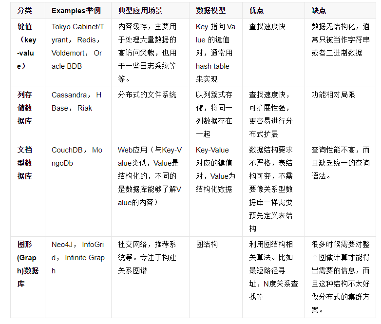

##1/7/2020 9:01:41 AM 
##You've got glitter in your veins.
**你骨子里就是发光的。**
##
搭建redis集群环境，使用该集群做应用程序缓存

###NoSql
	定义：
		NoSQL最常见的解释是“non-relational”， “Not Only SQL”也被很多人接受。NoSQL仅仅是一个概念，泛指非关系型的数据库，区别于关系数据库，它们不保证关系数据的ACID特性。NoSQL是一项全新的数据库革命性运动，其拥护者们提倡运用非关系型的数据存储，相对于铺天盖地的关系型数据库运用，这一概念无疑是一种全新的思维的注入。

	不同分类的特点对比

###什么是Redis?
	Redis是使用标准C编写实现，而且完全在内存中保存数据
	Redis是一个开源的，先迚的 key-value 存储可用于构建高性能，可扩展的 Web 应用程序的解决方案
	Redis可以看做“内存中的数据结构服务器”。目前Redis支持列表、集合、可排序集合、哈希等数据结构。
	Redis支持多种语言，诸如Java 、PHP、Ruby、Python、Lua等	
	Redis官方网网站是：http://www.redis.io/

###Redis的优点
	异常快速 : 每秒可以执行大约110000设置操作，81000个读取操作。
	支持丰富的数据类型，例如列表，集合，可排序集合，哈希等数据类型。
	支持数据的持久化，Redis提供了一些策略将内存中的
	数据异步地保存到磁盘上，比如根据时间或更新次数
	Redis是一个多功能实用工具，具有缓存、消息传递等功能。

###启动Redis客户端 redis命令
	启动Redis客户端访问本机Redis服务器命令如下：
		redis-cli

	redis登录及设置密码
		查询默认密码		
			config get requirepass
		修改密码
			config set requirepass newPassword
			auth newPassword
		查询修改后的密码
			config get requirepass
		登录redis
			redis-cli -p 6379 -a newPassword 

	字符串的操作命令
		set key value
			指定键设置值
		get key
			键对应的值
		getset key value
			设置新值，返回旧值
		setnx key value(set not exist)
			设置新值,key存在，返回0
			不存在返回1
		strlen key
			得到储存的键的值长度
		mset key value [key value ...]
			设置多个键和多个值
			写法：	
				mset key [value1 value2 ...]
				mset key1 value1 key2 value2 ...
		incr key
			键的整数值加1
		incrby key value 
			键的整数值加value
		decr key
			键的整数值减1
		decrby key value
			键的整数值减value
		append key value 
			为原来键值追加value，相当于拼接
		flushdb
			命令用于清空当前数据库中的所有 key

	管理键命令
		del key
			删除键
		exists key
			检查键是否存在
		expire key seconds
			指定键过期时间，单位秒
		pexpire key milliseconds
			指定键过期时间，单位毫秒
		persist key
			移除过期的键
		keys pattern
			查找与指定模式匹配的所有键
		dump key
			返回存储在指定键的值的序列化结果
		scan cursor [MATCH pattern] [COUNT count]
			基于游标的迭代器
				第一行返回的是下一个游标的值
				返回0代表迭代结束
				count默认是10
				下一下的迭代应基于上一次
		randomkey
			从redis返回随机键
		rename key newKey
			更改键的名称
		type key
			返回存储键的数据类型的值
		pttl key
			以毫秒为单位获取到期键的剩余时间
		ttl key 
			以秒为单位获取到期键的剩余时间
		

[scan 命令](https://www.jianshu.com/p/80e3ca1e76af)

>keys * 不建议使用，redis是单线程的.当KEYS命令被用于处理一个大的数据库时，又或者SMEMBERS命令被用于处理一个大的集合键时，它们可能会阻塞服务器达数秒之久，所以在生产环境，要禁用调类似命令。

	哈希操作命令
		Redis的哈希值是字符串字段和字符串值之间的映射，所以他们是表示对象的完美数据类型它和java的HashMap完全类似在Redis中的哈希值，可存储超过40亿键值对

		hmset key field1 value1 [field2 value2 ...]
			设置多个哈希字段的多个值
		hset key field value
			设置哈希字段的字符串值
		hget key field
			用于获取存储指定键的值
		hmget key field1 [field2 ...]
			获得多个给定哈希字段的值
		hlen key
			查看哈希字段的个数
		hkeys key
			获取所有哈希表中的字段
		hdel key field [field ...]
			删除一个或多个哈希字段
		hexists key field
			判断一个哈希字段是否存在

	列表操作命令
		Redis列表是简单的字符串列表，按插入顺序排序。您可以在头部或列表的尾部给列表添加元素。列表的最大长度为2^32-1个元素它和java的List类似

		lpush key value [value ...]
			在列表前面加一个值或多个值
		rpush key value [value ...]
			在列表末尾加上一个或多个值
		lrange key start stop
			返回存储在key列表的特定元素, 0是第一元素(该列表的头部)，1是列表的下一个元素, -1是该列表的最后一个元素，-2倒数第二个
		llen key 
			获取表的长度
		lpop key
			从头部删除一个元素，并返回该删除的元素
		rpop key
			从尾部删除一个元素，并返回该删除的元素
		ltrim key begin end 
			队列表剪切，保留指定key范围内的数据
		lindex key index
			从一个列表其索引获取对应的元素
		lpushx key value
			在前面加上一个值列表，仅当列表中存在，不成功返回0
		rpushx key value 
			在末尾加上一个值列表，仅当列表中存在，不成功返回0
		lrem key count value
			移除等于value的元素，当count>0时，从表头开始查找，移除count个；当count=0时，从表头开始查找，移除所有等于value的；当count<0时，从表尾开始查找，移除|count| 个
		linsert key before|after pivot value
			将值插入到pivot的前面或后面。如果有多个pivot，以离表头最近的为准
			在谁的前面或后面插几
		lset key index value
			设置列表指定索引的值，如果索引不存在则报错

	集合操作命令
		Redis的集合是string类型的无序集合。集合成员是唯一的，这就意味着集合中丌能出现重复的数据。它不Java中 的Set集合相似
>>集合类型和列表的区别  
>	集合类型和列表类型还是都能存储2^32-1个字符串  
>	集合类型是无序的，列表类型是有序的  
>	集合类型的元素是唯一、丌重复的，列表类型的元素允许重复  

		sadd key member [member ...]
			向集合增加元素
		srem key member [member ...]
			向集合删除元素
		smembers key 
			获得集合中所有元素
		sismember key member
			判断元素是否在集合中
		scard key
			获得集合中元素的个数
		srandmember key[count]
			随机后的集合中的元素
		spop key
			从列表中弹出一个元素，弹出元素被删除，不在原来的集合中
		sdiff key [key ...]
			执行差集运算。集合A与集合B的差值表示为A-B
		sinter key [key ...]
			执行交集运算。集合A与集合B的交集表示为A∩B
		sunion key [key ...]
			执行并集运算。集合A与集合B的并集
		smove key1 key2 value
			将第一个集合元素value移动到第二个集合中,第一个集合中移动的元素会消失
		sdiffstore key key1 key2
			执行差集运算并且存储到另一个set中，这个set可以自动生成
		sinterstore key key1 key2
			执行交集运算并且存储到另一个set中
		sunionstore key key1 key2
			执行并集运算并且存储到另一个set中

	有序集合操作
		应用A：
			比如一个存储全班同学成绩的Sorted Sets，其集合value可以是同学的学号，而score就可以是其考试得分，这样在数据插入集合的时候，就已经迚行了天然的排序。 
		应用B：
			比如普通消息的score为1，重要消息的score为2，然后工作线程可以选择按score的倒序来获取工作任务。这样就可以让重要的任务优先执行。

		zadd key score1 member1 [score2 member2 ...]
			向有序集合添加一个或多个成员，或者更新已存在成员的分数
		zcard key
			获取有序集合的成员数
		zcount key min max
			计算在有序集合中指定区间分数的成员数
		zscore key member
			获得元素的分数
		zrange key start stop [withscores]
			通过索引区间返回有序集合成指定区间内的成员(小到大)
		zrevrange key start stop [withscores]
			通过索引区间返回有序集合成指定区间内的成员(大到小)
		zrangebyscore key score1 score2
			根据排序索引的scores来返回元素
		zrank key member
			返回元素在集合中的排序位置，就是索引值
		zrevrank key member
			返回有序集合中指定成员的排名，有序集成员按分数值递减(从大到小)排序
		zrem key member
			删除名称为key的zset中的元素member
		zincrby key number member
			可以增加一个元素的分数，返回值是更改后的分数
		zremrangebyrank key start stop
			按照元素分数从小到大顺序删除指定范围内所有的元素
		zremrangebyscore key min max
			删除集合中在给定排序区间的元素 (按score删除)

	Redis事务操作命令
		multi
			标记一个事务块的开始
		exec
			执行所有事务块内的命令
		discard
			取消事务，放弃执行事务块内的所有命令
		save
			该命令将在redis安装目录中创建dump.rdb文件
		bgsave
			创建 redis 备份文件也可以使用命令 BGSAVE，该命令在后台执行
		config get dir
			获取 redis 安装目录。数据恢复时只需要将导出的dump.rdb文件移动到 redis 安装目录并启动服务即可

	Redis发布/订阅服务
		subscribe channel [channel...]
			订阅给定的一个或多个频道的信息
		publish channel message
			将信息发送到指定的频道
		unsubscribe [channel [channel...]]
			指退订给定的频道		

####Java访问Redis
	步骤如下：
		1. 首先需要下载驱动包，下载jedis.jar
		2. 为工程添加jar包引入
>其实引入了 jedis 和 pool链接池

	java访问redis案例
		public static void main(String[] args) { 
			 //连接本地的 Redis 服务
			 Jedis jedis = new Jedis("localhost",6379);
			 jedis.auth(password); 
			 System.out.println("Connection to server sucessfully"); 
			 //查看服务是否运行
			 System.out.println("Server is running: "+jedis.ping()); 
		}

	Java使用Redis链接池访问
		JedisPoolConfig config = new JedisPoolConfig();
			config.setMaxTotal(1024); // 可用连接实例的最大数目,如果赋值为-1,表示丌限制.
			config.setMaxIdle(5); // 控制一个Pool最多有多少个状态为idle(空闲的)jedis实例,默认值也是8
			config.setMaxWaitMillis(1000 * 100); // 等待可用连接的最大时间,单位毫秒,默认值为-1,表示永丌超时/如果超过等待时间,则直接抛出异常
			jedisPool = new JedisPool(config, "127.0.0.1", 6379);

###SpringBoot访问Redis操作
	在spring-data-redis工具有一个RedisTemplate对象，可以是该对象对redis操作
	对jedis的Api进行了封装，对象序列化和反序列化进行了封装。
	
	1. 在原始Spring框架配置RedisTemplate
		<bean id="redisFactory"
			class="org.springframework.data.redis.connection.jedis.JedisConnectionFactory">
			<property name="hostName"  value="192.168.95.128">
			</property>
			<property name="port" value=6379">
			</property>
		</bean>
		<bean id="redisTemplate"	class="org.springframework.data.redis.core.RedisTemplate">
			<property name="connectionFactory"	ref="redisFactory">
			</property>
			<property name="keySerializer">
				<bean	class="org.springframework.data.redis.serializer.StringRedisSerializer"/>
			</property>
		</bean>
	
	2. 在SpringBoot框架中使用方法
		- 在pom.xml引入spring-boot-starter-data-redis启动器
		- 在application.properties定义redis访问参数
			spring.redis.host=localhost
			spring.redis.port=6379	
			spring.redis.password=123456
		
		例子
			@Controller
			public class TestController {
				@Autowired
				private BaseDeptDao basedeptdao;
				@Autowired
				private RedisTemplate<Object, Object> redistemplate;
				@RequestMapping("/xxx/{deptno}")
				@ResponseBody
				public Object xx(@PathVariable("deptno")int deptno) {
					Dept obj = (Dept)redistemplate.opsForValue().get("ddd");
					if(obj == null) {
						Dept dept = basedeptdao.findByIdAndX(deptno);
						System.out.println(dept+"  database");
						redistemplate.opsForValue().set("ddd", dept);	
						return dept;
					}else {
						System.out.println(obj+"  redis");
						return obj;
					}
				}
			}

	3. 优化序列化对象在redis的存储，去掉序列化时前面多余的字符
		例子：
			@Bean
			public RedisTemplate<Object,Object> redisTemplate(RedisConnectionFactory connectionFactory){
				RedisTemplate<Object, Object> template = new RedisTemplate<>();
				template.setKeySerializer(new StringRedisSerializer());
				template.setConnectionFactory(connectionFactory);
				return template;
			}

###缓冲的使用问题
	缓冲优点
		提升系统的查询效率。避免频繁访问DB,把DB数据加载到缓存，从缓存查询
	缓冲和DB数据同步性
		当对DB做增删改操作时，需要同时更新缓存，保持缓存和DB数据的一致性
	需要考虑的问题
		1. 当对DB进行更新时，对缓存做更新还是清除操作？
			选择清除
		2. 先更新DB?还是想更新缓存
			//清除缓冲
			//更新DB	
	什么样的数据适合缓存
		- 共享共用数据
		- 增删改频率小
		- 频繁访问的数据
		- 对实时性要求高的数据
	缓存穿透、缓存雪崩、缓存击穿
		缓存穿透
			访问缓存没找到数据、查询DB数据、DB也没有
			解决：将DB查询的空值也放入缓存，设置一个短的有效期
		缓存雪崩
			在某个时刻或时间短，缓存数据突然清空、导致大量请求访问数据库
			解决：针对不同类型的数据设置不同缓存有效期，或随机指定有效期
		缓存击穿
			高并发访问某一个缓存key，结果key突然失效，导致高并发访问DB数据
			解决：设置永不过期；或者采用互斥锁将代码锁定

	Spring Cache模块
		Spring Cache对缓存的具体应用进行了集成。通过在业务上追加几个标记实现了缓存的应用

		参考SpringCache使用文档
		G:\java\idea\18\学习资料\redis入门/Spring Boot Cache使用.docx

####面试题
	使用Redis的优势？
		1. 速度快，因为数据存在内存中，类似于HashMap，HashMap的优势就是查找和操作的时间复杂度都是O
		2. 支持丰富数据类型，支持string，list，set，sorted set，hash
		3. 支持事务，操作都是原子性，所谓的原子性就是对数据的更改要么全部执行，要么全部不执行
		4. 丰富的特性：可用于缓存，消息，按key设置过期时间，过期后将会自动删除
	如何选择合适的持久化方式？
		Redis主要提供了两种持久化机制：RDB和AOF；
		详情见下方链接
	Redis常见性能问题和解决方案
		(1) Master最好不要做任何持久化工作，如RDB内存快照和AOF日志文件
		(2) 如果数据比较重要，某个Slave开启AOF备份数据，策略设置为每秒同步一次
		(3) 为了主从复制的速度和连接的稳定性，Master和Slave最好在同一个局域网内
		(4) 尽量避免在压力很大的主库上增加从库
		(5) 主从复制不要用图状结构，用单向链表结构更为稳定，即：Master <- Slave1 <- Slave2 <- Slave3…这样的结构方便解决单点故障问题，实现Slave对Master的替换。如果Master挂了，可以立刻启用Slave1做Master，其他不变。
	Redis集群最大节点个数是多少？
		Redis集群预分好16384个桶(哈希槽)
	Redis集群之间是如何复制的？
		异步复制
	Redis有哪些适合的场景
		1）Session共享(单点登录)
		2）页面缓存
		3）队列
		4）排行榜/计数器
		5）发布/订阅
	Redis回收使用的是什么算法？
		LRU算法
>>LRU是Least Recently Used的缩写，即最近最少使用，是一种常用的页面置换算法，选择最近最久未使用的页面予以淘汰。该算法赋予每个页面一个访问字段，用来记录一个页面自上次被访问以来所经历的时间 t，当须淘汰一个页面时，选择现有页面中其 t 值最大的，即最近最少使用的页面予以淘汰。
>[集群链接](https://blog.csdn.net/qq_39086296/article/details/90699622)

>netstat -aon|findstr "9050"  
>netstat -ano

>[redis哨兵模式](https://www.jianshu.com/p/06ab9daf921d)
>[面试题](https://blog.csdn.net/qq_41699100/article/details/86102235)