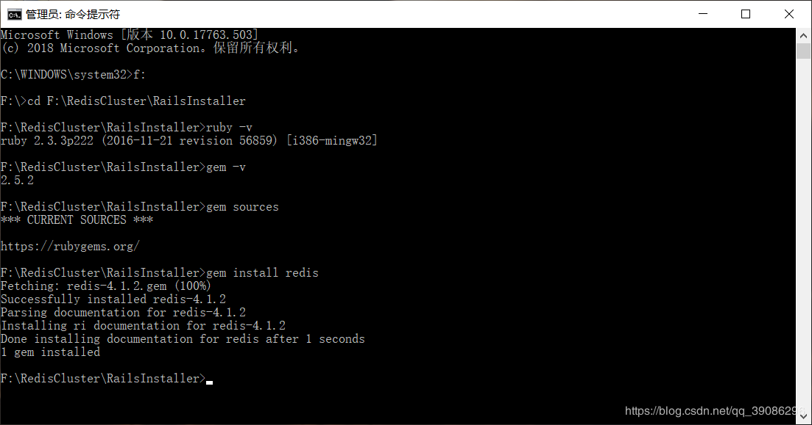
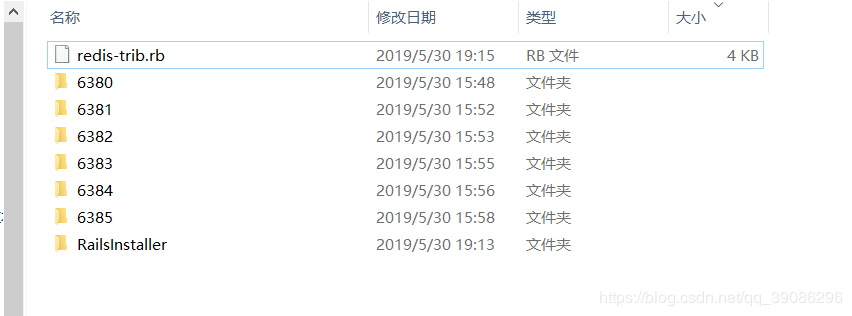
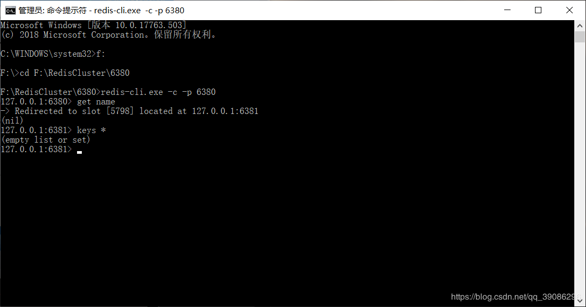
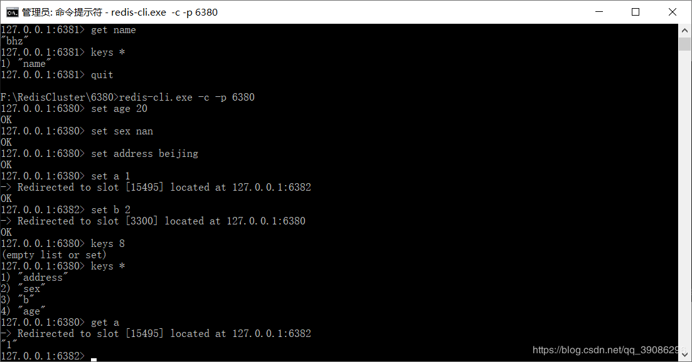
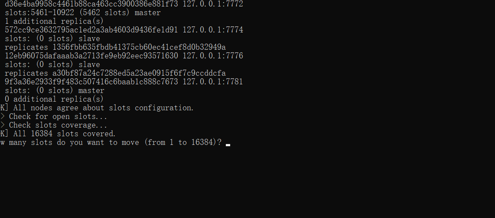

##1/8/2020 10:35:43 PM 
##You have to spin a good yarn before you can weave a great dream.
**你得先备好针线，才能织出更好的美梦。**
###
集群环境的搭建

####首先下载好Redis的Windows版本，注意：Redis只有3.0之后的版本才有集群
>[引用](https://blog.csdn.net/qq_39086296/article/details/90699622)  
>[redisDownload](https://github.com/microsoftarchive/redis/releases)
***
	1. 创建一个RedisCluster文件夹，copy开始下载的redis解压后的目录，并修改文件名（比如按集群下redis端口命名）
	2. 在redisPort目录下新建一个start.bat文件，下次启动时直接执行该脚本即可
		title redis-7771
		redis-server.exe redis.windows.conf
	3. 接着分别打开各个文件下的 redis.windows.conf，分别修改如下配置
		port 6380 //修改为与当前文件夹名字一样的端口号
		appendonly yes //指定是否在每次更新操作后进行日志记录，Redis在默认情况下是异步的把数据写入磁盘，如果不开启，可能会在断电时导致一段时间内的数据丢失。 yes表示：存储方式，aof，将写操作记录保存到日志中
		cluster-enabled yes //开启集群模式
		cluster-config-file nodes-6380.conf  //保存节点配置,自动创建,自动更新(建议命名时加上端口号)
		cluster-node-timeout 15000 //集群超时时间，节点超过这个时间没反应就断定是宕机
>在修改配置文件这几项配置时，配置项前面不能有空格
***
	4. 其他文件节点 7771~7776也修改相应的节点配置信息和建立启动脚本
	
####下载Rubby并安装
>[rubby](　http://dl.bintray.com/oneclick/rubyinstaller/rubyinstaller-2.2.4-x64.exe)  

	1. 下载完成后安装，一步步点next直到安装完成(安装时勾选3个选项)
	2. 然后对ruby进行配置：

	3. 构建集群脚本redis-trib.rb,保存到一个Redis的目录下。如图
[redis-trib.rb Download](http://www.bvbcode.com/cn/m6c7xuz0-3099929-down)

	4. 然后依次启动所有集群节点start.bat
	5. 然后cmd进入redis集群节点目录后，执行： （–replicas 1 表示为集群中的每个主节点创建一个从节点）
		ruby redis-trib.rb create --replicas 1 127.0.0.1:6380 127.0.0.1:6381 127.0.0.1:6382 127.0.0.1:6383 127.0.0.1:6384 127.0.0.1:6385
		如图：

	6. 上图可看出 主节点为6380,6381,6382 端口的三个地址，6383,6384,6385为三个从节点，（Master表示主节点，Slave表示从节点）
	7. 中途会询问是否打印更多详细信息，输入yes即可，然后redis-trib 就会将这份配置应用到集群当中,让各个节点开始互相通讯

####测试
	1. 进入任意一个集群节点，cmd执行redis-cli.exe -c -p 6380，-c表示集群模式，-h表示ip地址，-p表示端口

>-c:表示连接的是集群，这样就可以自动重定向到其他的节点

####[springboot整合redis集群环境]("https://blog.csdn.net/qq_34409255/article/details/80206490")

	1. 引入maven依赖
		<dependency>
		   <groupId>org.springframework.boot</groupId>
		   <artifactId>spring-boot-starter-redis</artifactId>
		   <version>1.4.7.RELEASE</version>
		</dependency>
		<dependency>
		   <groupId>redis.clients</groupId>
		   <artifactId>jedis</artifactId>
		</dependency>
	2. 配置applicaiton.propeties
		spring.datasource.username=root
		spring.datasource.password=123456
		spring.datasource.driverClassName=com.mysql.jdbc.Driver
		spring.datasource.url=jdbc:mysql://localhost:3306/xxx

		#spring.redis.host=localhost
		#spring.redis.port=6379	
		#spring.redis.password=123456
		server.port=8888
		# 连接池中的最大空闲连接
		spring.redis.jedis.pool.max-active=8  
		# 连接超时时间（毫秒）
		spring.redis.commandTimeout=5000
		# redis.cluster	spring.redis.cluster.nodes=127.0.0.1:7771,127.0.0.1:7772,127.0.0.1:7773,127.0.0.1:7774,127.0.0.1:7775,127.0.0.1:7776
	3. 在启动类开启缓存注解
		@SpringBootApplication
		@EnableCaching
		public class RedisClusterSpringbootApplication {
		
		   public static void main(String[] args) {
		      SpringApplication.run(RedisClusterSpringbootApplication.class, args);
		   }
		}
	4. 配置redis配置类

		@Bean
		public RedisTemplate<Object,Object> redisTemplate(RedisConnectionFactory connectionFactory){
			RedisTemplate<Object, Object> template = new RedisTemplate<>();
			template.setKeySerializer(new StringRedisSerializer());
			template.setConnectionFactory(connectionFactory);
			return template;
		}
	5. 编写controller
		@Autowired
		private BaseDeptDao basedeptdao;
		@Autowired
		private RedisTemplate<Object, Object> redistemplate;
		
		@RequestMapping("/add")
		@ResponseBody
		@Cacheable(value="dept", key="#deptno")
		public Object addDept(
				@RequestParam("deptno")int deptno,
				@RequestParam("dname")String dname,
				@RequestParam("loc")String loc) {
				Object obj = redistemplate.opsForValue().get("dept::"+deptno);
				if(obj!=null) {
					System.out.println(obj+"  redis cache");
				}
				int num = basedeptdao.addDept(deptno,dname, loc);
				Dept dept = basedeptdao.findByIdAndX(deptno);
				return dept;
		}
	
		@RequestMapping("/select/{deptno}")
		@ResponseBody
		@CachePut(cacheNames = "dept", key ="#deptno")
		public Object xxxx(@PathVariable("deptno")int deptno) {
				Object obj = redistemplate.opsForValue().get("dept::"+deptno);
				if(obj!=null) {
					Object obj1 = redistemplate.opsForValue().get("dept::"+deptno);
					System.out.println(obj1+"  redis cache");
				}
				Dept dept = basedeptdao.findByIdAndX(deptno);
				System.out.println(dept+"  database");
				return dept;
		}

		//@CacheEvict(value="dept",beforeInvocation=true,key="#deptno")
		@RequestMapping("/up")
		@ResponseBody
		public int upDept(@RequestParam("loc")String loc,
				@RequestParam("deptno")int deptno) {
			int i = basedeptdao.upDept(loc, deptno);
			return i;
		}
		
		@RequestMapping("/de")
		@ResponseBody
		@CacheEvict(value="dept",allEntries=true,key="#deptno")
		public int deDept(@RequestParam("deptno")int deptno) {
			int num = basedeptdao.deDept(deptno);
			return num;
			
		}

####Redis集群增加和删除节点
	登录节点
		redis-cli.exe -c -p port
	查看节点信息
		cluster nodes
	添加主节点
		ruby redis-trib.rb add-node 127.0.0.1:7781 127.0.0.1:7771 
	删除主节点
		1.  将主节点7781的slots分配到其他结点上
		2. 调用删除命令 redis-trib.rb del-node 127.0.0.1:7781
	添加从节点
		集群创建成功后可以向集群中添加节点，下面是添加一个slave从节点。
		例：添加7008从结点，将7008作为7007的从结点。		
		执行命令 ruby redis-trib.rb add-node --slave --master-id 主节点id  添加节点的ip和端口  集群中已存在节点ip和端口
>注意：如果原来该节点在集群中的配置信息已经生成cluster-config-file指定的配置文件中（如果cluster-config-file没有指定则默认为nodes.conf），这时可能会报错：
>>[ERR] Node XXXXXX is not empty. Either the node already knows other nodes (check with CLUSTER NODES) or contains some key in database 0
>>>>解决方法：
>删除生成的配置文件nodes.conf，删除后再执行rudy redis-trib.rb add-node指令
>CachePut注解在使用的时候是先进行数据库的查库操作，然后在更新缓存，由于要更新缓存，所以一定要指定所要操作的缓存的名称
####集群的优点
	P2P模式，无中心化
	把key分成16384个slot
	每个实例负责一部分slot
	客户端请求若不在连接的实例，该实例会转发给对应的实例。
	通过Gossip协议同步节点信息
	优点：
		组件all-in-box，部署简单，节约机器资源
		性能比proxy模式好
		自动故障转移、Slot迁移中数据可用
		官方原生集群方案，更新与支持有保障
	缺点：
		架构比较新，最佳实践较少
		多键操作支持有限（驱动可以曲线救国）
		为了性能提升，客户端需要缓存路由表信息
		节点发现、reshard操作不够自动化
>all -in box 是款专门为安卓设备研发的综合型系统管理工具。它提供最全面的系统优化功能，包括即时记忆体资讯展示，进程清理，缓存清理，SD卡档管理，历史记录清除，开机项管理等等。这些功能从各个角度帮助您优化设备性能，能有效的助您解决手机反应慢、耗电快等问题 [1]  。
####hash槽的重新分配
	添加完主节点需要对主节点进行hash槽分配这样改主节才可以存储数据
	redis集群有16384个槽，集群中的每个节点分配自己槽，通过查看集群节点可以看到槽占用情况
		cluster nodes
	给刚添加的7781节点分配槽
		1. 连接上集群
			ruby redis-trib.rb reshard 127.0.0.1:7771（链接集群任意可用节点都行）
		2. 输入要分配的槽数量

		3. 输入接收槽的结点id

	通过 cluster nodes查看  7781结点id 9f3a36e2933f9f483c507416c6baab1c888c7673

		4. 输入all/done
		输入源节点id,槽将从源节点中拿，分配后的槽在源节点中就不存在，输入all从所有源节点中获取槽，输入done取消分配
		5. 输入yes开始移动槽到目标结点id

>>解决集群问可以考虑使用命令“redis-trib.rb fix 192.168.0.3:1986”尝试修复。需要显示有节点处于migrating或importing状态，可以登录到相应的节点，使用命令“cluster setslot (8530 stable”修改，参数8530为问题显示的slot的ID。