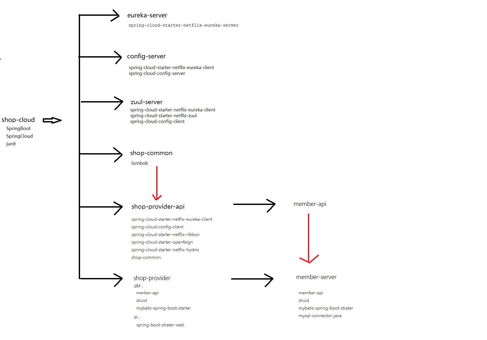

###4/20/2020 1:01:06 PM 
###What we do in life echoes in eternity.
**生命中走过的足迹会在历史中留下永恒的印记。**
###
秒杀分布式项目总结

###一 项目模块搭建
####1. 创建parent模块
	01. 创建quickstart项目，把src目录删除，删除多余的依赖，并在pom.xml声明项目类型为pom类型.
	02. 添加SpringCloud相关的配置信息
####2. 创建注册中心Eureka
	01. 在cloud-shop项目下创建module,类型为quickstart,名字为euraka-server.
	02. 把pom文件中的多余依赖删除,把src/test目录删除
	03. 添加eureka-server依赖
	04. 把项目中的app.java重命名为EurakaServerApplication.java
	05. 在EurakaServerApplication中添加SpringBoot启动的注解及mian方法,同时贴上@EnableEurekaServer注解
	06 .在resources目录中添加application.yml配置文件，并添加端口,注册信息配置.
	07. 启动测试
####3.  配置中心config-server
	01. 在cloud-shop项目下创建module,类型为quickstart,名字为config-server.
	02. 把pom文件中的多余依赖删除,把src/test目录删除
	03. 把项目中的app.java重命名为ConfigServerApplication.java
	04. 在ConfigServerApplication类上贴上@EnableConfigServer注解

####4. 配置网关Zuul
	01 .在cloud-shop项目下创建module,类型为quickstart,名字为zuul-server.
	02. 把pom文件中的多余依赖删除,把src/test目录删除
	03. 把项目中的app.java重命名为ZuulServerApplication.java
	04. 在pom文件中添加eureka-client，netflix-zuul，config-client依赖
	05. 在resource目录中添加bootstarp.yml配置文件
	06. 在启动类中添加@EnableZuulProxy注解
	07 .在config-server项目中添加resources/config/zuul-server.yml配置文件，并添加相关信息
	08. 启动测试，查看端口是否9000.如果是说明已经读取了配置中心中的zuul-server.yml的配置信息

####5. 公共模块 shop-common
	01. 在cloud-shop项目下创建module,类型为quickstart,名字为shop-common. 
	02. 把pom文件中的多余依赖删除,把src/test目录删除,把App.java文件删除 
	03. 再pom文件中添加lombok依赖.

####5. 服务接口父模块
	01. 在cloud-shop项目下创建module,类型为quickstart,名字为shop-provider-api
	02. 把src目录删除，删除多余的依赖，项目类型声明为pom类型

####6. 服务父模块
	01. 在cloud-shop项目下创建module,类型为quickstart,名字为shop-provider
	02. 把src目录删除，删除多余的依赖，项目类型声明为pom类型

###项目结构依赖图

