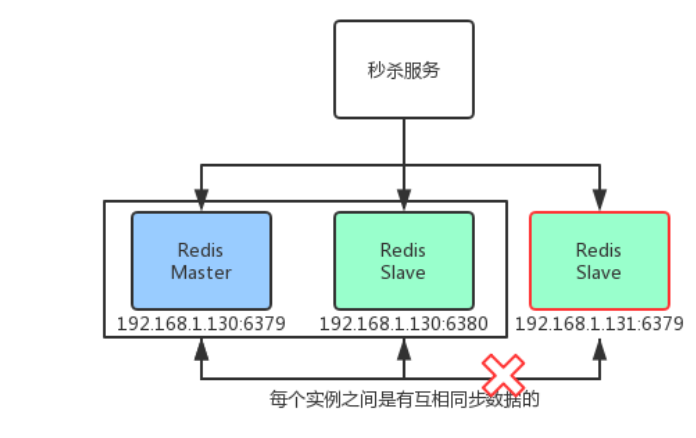
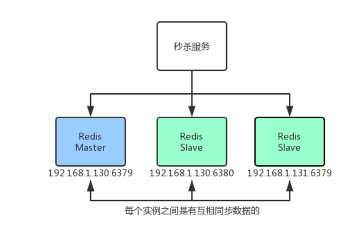

##5/6/2020 8:02:08 PM 
###When all the clouds darken up the skyway, there's a rainbow highway to be found.
**当乌云密布，彩虹会为你铺就一条道路。**
###
cap_theory

####1. P 分区容错性 Partition tolerance

	1. 单机故障
		将所有的应用部署到一台机器上时，一旦机器发生故障，所有的服务都不能再使用
	解决方案
		可以通过主从，集群来解决该问题，但是需要注意的时，服务节点需要部署到两台机器上才行。
		

	2. 分区容错性的概念
		在上述图片中，可以把分布到不同服务器的redis称为一个分区，如图有两个
	
####2. A 可用性 Availability

	在分布式的系统中，支持可用性，任意情况下，提供服务的系统都支持访问
	
	如图：
		1. 若131分区不可用，130分区两个redis实例能提供响应
		2. 若秒杀服务写操作提交到130从节点上，根据Redis官方集群策略，会将请求转发到主节点上，进行访问
		3. 若访问的主节点挂掉，会通过选举从节点中选取新的主节点，完成访问。

	基于以上三点，可以判定redis集群方案下，是符合可用性的
..
.
####3. C 一致性	Consistency

	在一个分布式形同中，在两个不同的分区/实例中进行访问，都能返回一致的数据
	
	注意：
		Redis虽然访问率很高，但是由于并发、网络抖动的原因，导致同步效率没有那么及时，所以Redis不支持CAP中C一致性（强一致性）的概念，但是redis支持最终一致性的概念。

#####注意事项
	一个分布式系统中，最多支持AP/CP，不可能同时支持CAP或CA
	本质原因：
		高可用性A 和 强一致性 C 存在强烈冲突
	
	例子：
		在Redis集群中，如果想要保持强一致性，需要在同步数据时，将整个集群锁住，这样就破坏了redis的可用性

		反之想要保护redis可用性，就要牺牲强一致性，因为在其同步数据时，不能将集群环境锁住
		

.

.
		